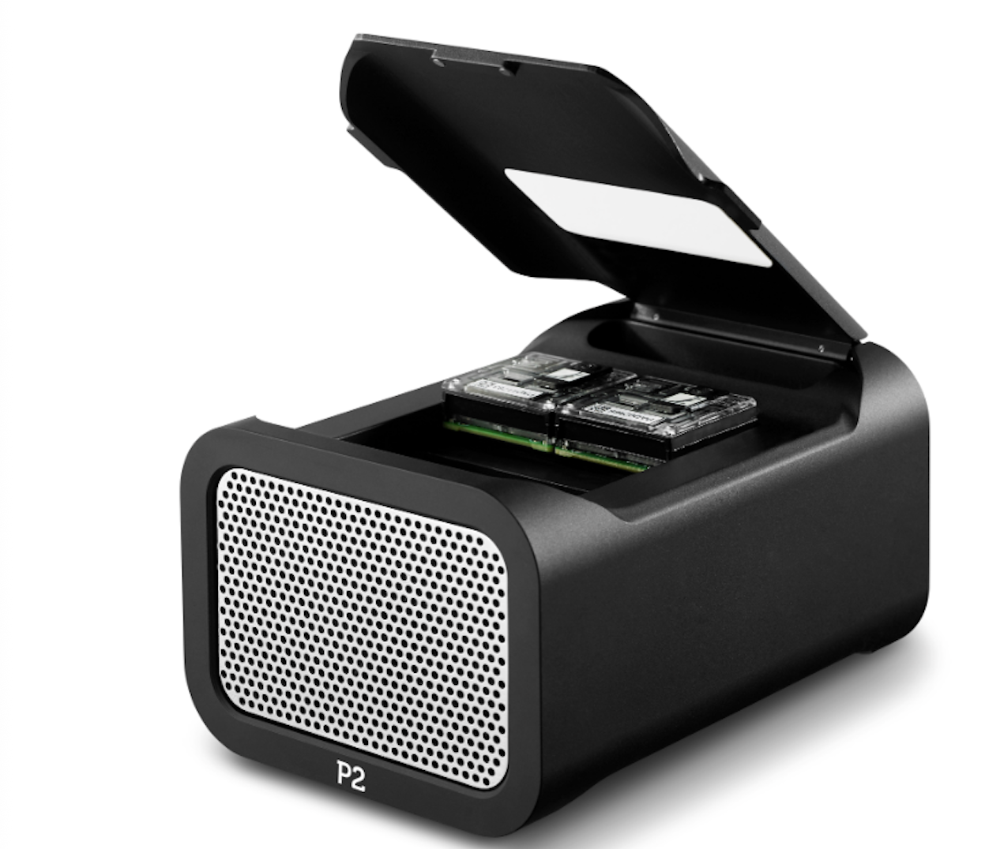
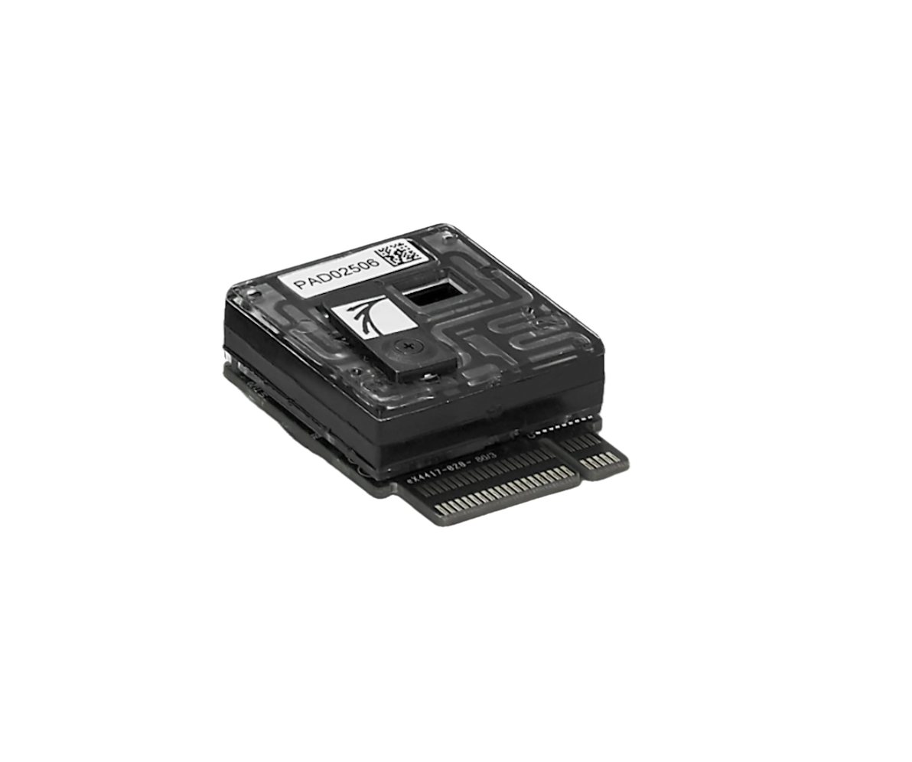
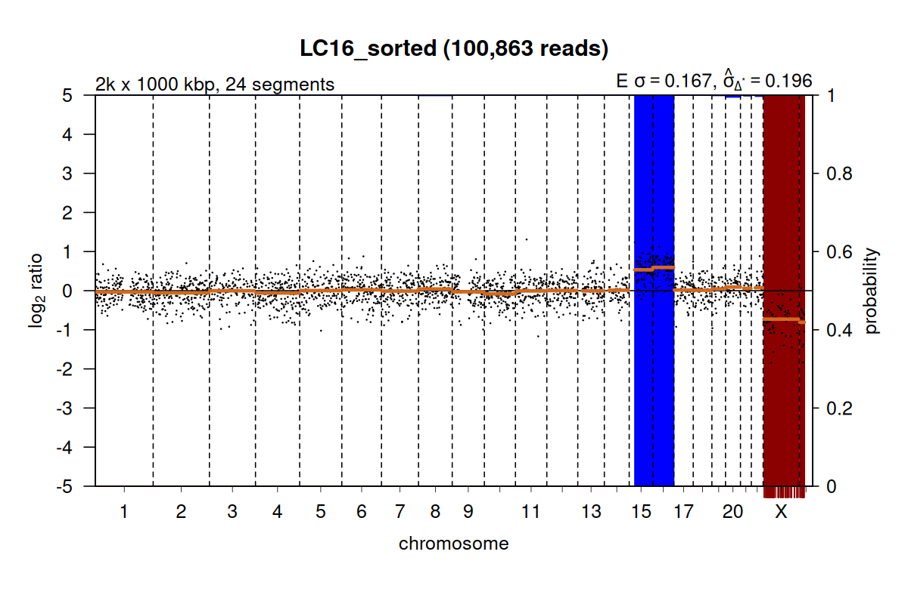
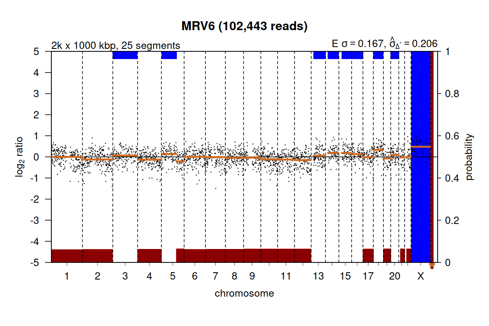
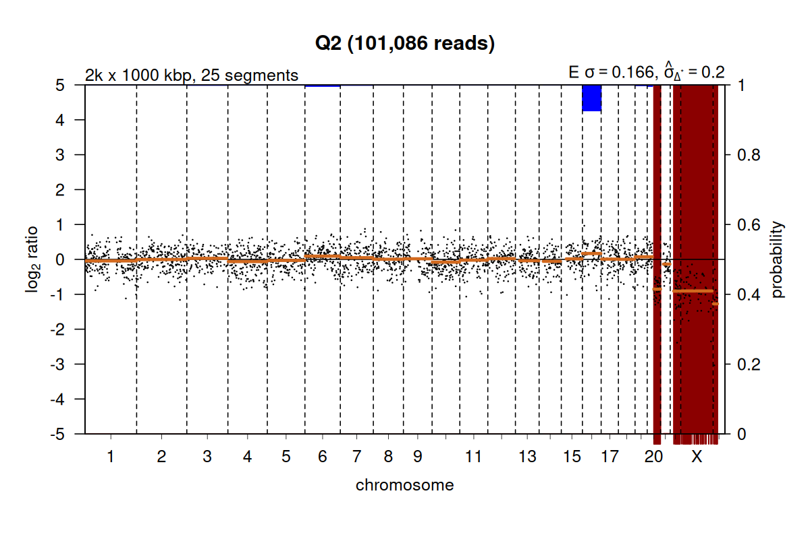
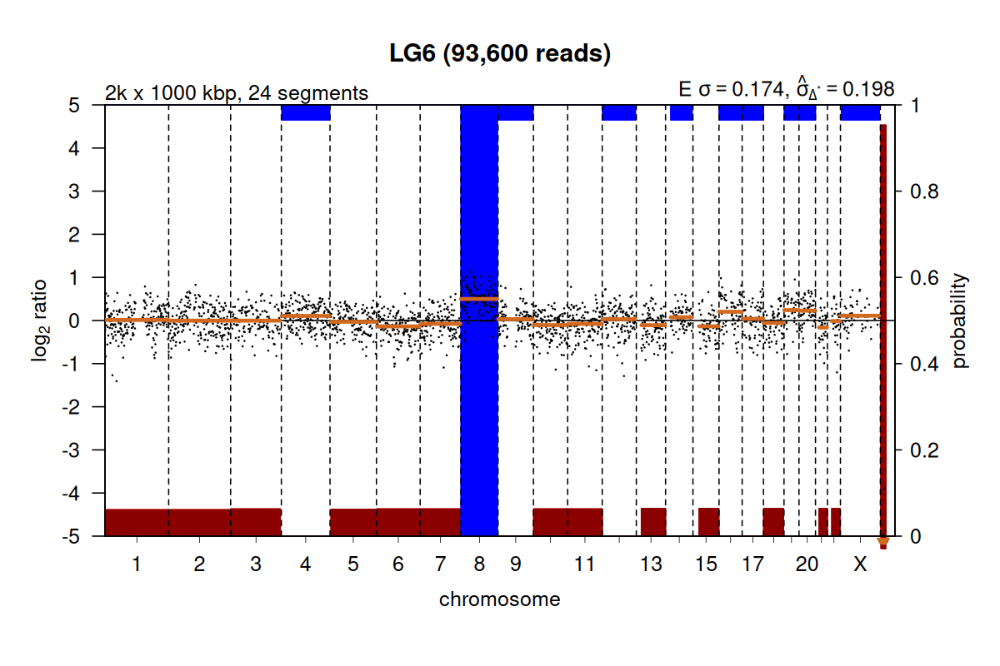
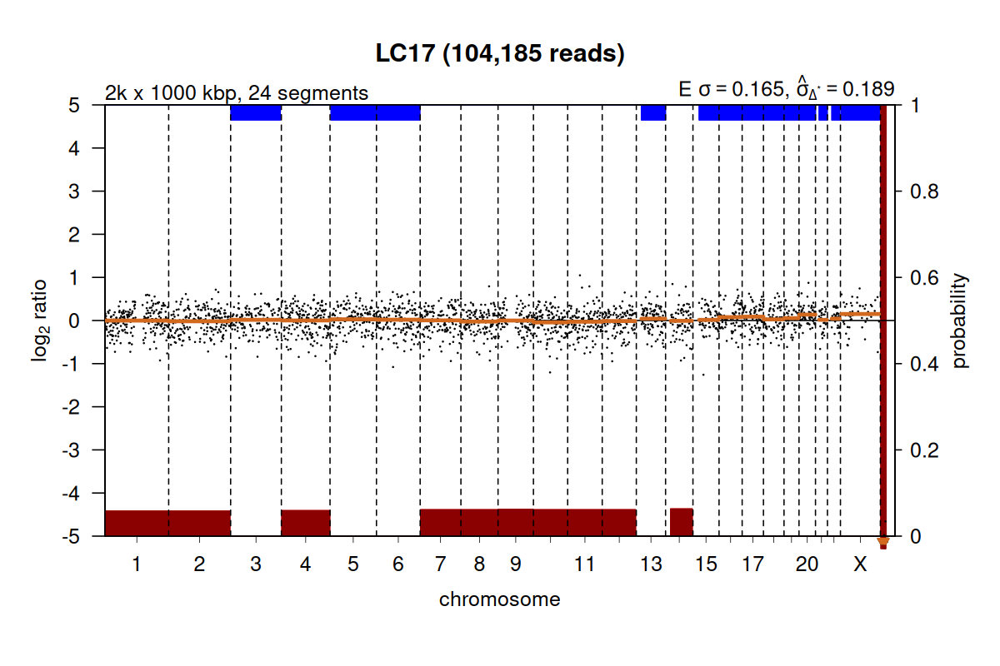
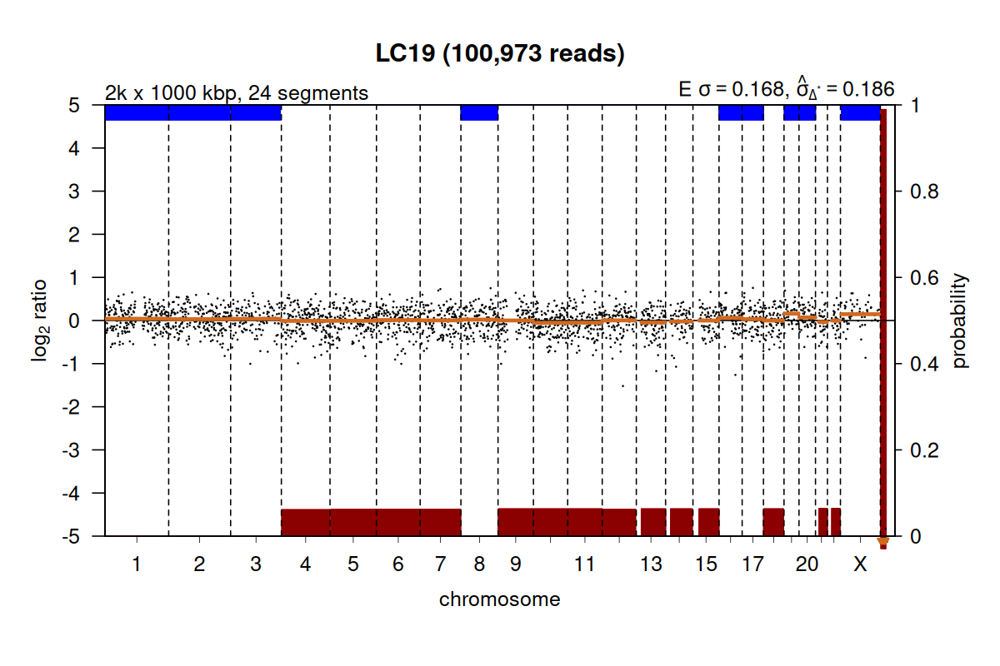

::: callout-note
## Links
**Insumos**: [Apéndice técnico](../appendix-technical.qmd). [Reporte Havanna FCEN](../inputs/FCEN/report_Nanopore_seq.html).

**Delivery 4**:  [Apéndice económico](../appendix-costsRBKRAA.qmd).
:::

## 1. Ensayo Havanna- Rendimiento {#sec-Havanna-assay}

En enero 2026 el servicio de genómica de la FCEN secuenció muestras de ADN tomadas del freezer de Reprofert:

1.  Las muestras consistieron en **15 ADN congelados** (-20ºC),
    extraídos de biopsias embrionarias previamente amplificadas con
    Sureplex, derivadas de estudios de PGT-A realizados durante los años
    2016 al 2019, utilizando  [secuenciación Illumina](../appendix-technical.qmd#sec-pgt-illumina).

2.  La secuenciación en FCEN se llevó a cabo en un equipo
    **PromethION 2 Solo** (@fig-prometion-f A), con un flow cell FLO-PRO114M[^3] (@fig-prometion-f B), el cual produce **≈30 veces más secuencia por unidad de tiempo** que el [flow cell del MinION](../appendix-technical.qmd#sec-pgt-ont). 
    
3.  La corrida se detuvo a las 18 hrs y produjo **37.24 Gb**; **21.4Gb (Q≥8 ≈ 57.5%)** y 10.5 (28.2%) fail. El **total de lecturas ~60M; 42M (Q≥8 ≈ 70.0%)**, 19M (31,6%) fail. El **N50 = 552pb**. 

[^3]: Este FC contiene 2675 poros.

:::::: {#fig-prometion-f}
::::: columns
::: {.column width="50%"}
{width="100%"} **A**
:::

::: {.column width="50%"}
{width="100%"} **B**
:::
:::::
::::::

::: callout-note
Este rendimiento es verificable si se considera que se obtuvieron 37Gb en 18 hs de corrida (\~2.05 Gb/h). Comparando la totalidad de Gb producidos por Tan y col. ( [QC_in=1.07 Gb](../appendix-technical.qmd#sec-pgt-compara) + QC_out \~35%), la cantidad producida es de **≈ 32** veces más.
:::

## 2. Ensayo Havanna- Resultados por muestra {#sec-solo-muestras}

El ensayo Havanna generó por muestra, **1.03 Gb**, y **2.3 M de lecturas**[^4]. Esto es, el total de bases y lecturas producidas por Tan, V.J. el al., (2023), en su [ensayo para 24 muestras](../appendix-technical.qmd#sec-pgt-compara).

[^4]: Valores estimados a partir de medianas.

:::: {#tbl-barcodes tbl-cap="Rendimiento por muestra (barcodes únicos utilizados en la formación de la librería)."}
::: {style="width: 80%; margin: 0 auto; font-size: 0.85em;"}
| Etiqueta | Barcode | Total bases (Mb) | Passed bases (%) | Total reads (k) | Passed reads (%) |
|:-----------|:-----------|-----------:|-----------:|-----------:|-----------:|
| LC10 | barcode01 | 1286.39 | 83.9 | 2600.86 | 84.5 |
| LC16 | barcode02 | 2271.32 | 87.0 | 4617.92 | 87.4 |
| LC17 | barcode03 | 1437.46 | 85.7 | 2938.75 | 86.1 |
| LC19 | barcode04 | 2372.81 | 85.0 | 4752.55 | 85.0 |
| VB5 | barcode05 | 1407.03 | 81.6 | 2849.74 | 82.6 |
| VB6 | barcode06 | 2047.36 | 85.2 | 4203.68 | 85.7 |
| MVR3 | barcode07 | 1264.43 | 83.8 | 2608.02 | 84.6 |
| MVR6 | barcode08 | 1073.98 | 85.5 | 2167.51 | 85.7 |
| MVR7 | barcode09 | 723.67 | 85.1 | 1545.97 | 85.6 |
| Q2 | barcode10 | 1117.75 | 83.4 | 2170.88 | 84.2 |
| AV6 | barcode11 | 1624.30 | 81.3 | 3146.70 | 81.9 |
| AV13 | barcode12 | 1079.89 | 83.0 | 2141.44 | 83.4 |
| LG6 | barcode13 | 1173.17 | 88.5 | 2177.87 | 88.8 |
| MS14 | barcode14 | 1487.06 | 87.6 | 3317.96 | 88.2 |
| LN9 | barcode15 | 1152.78 | 82.3 | 2445.44 | 82.9 |
:::
::::

La @tbl-barcodes muestra los parámetros de rendimiento para cada una de las muestras.

::: callout-note 
## **Utilidad del exceso de secuencia** 

Aunque la producción de lecturas supera ampliamente lo necesario para un PGT-A clásico o el FastPGT, esta abundancia nos permite abordar aproximaciones no clásicas del PGT-A. Concretamente, podríamos analizar la presencia de polimorfismos (SNPs) comunes dispersos a \~1 Kb de distancia en el genoma humano, para preguntarnos por la presencia de poliploidías, haploidías, disomías uniparentales, contaminaciones externas, y parentesco entre embriones de una misma pareja, todas características del servicio de **PGT-A Plus**. 

La aplicación de estrategias de **downsampling** para la generación de subconjuntos reducidos y aleatorios de lecturas (por ejemplo, 5%, 10%, 25%), nos permite explorar de manera sistemática la combinación óptima de parámetros operativos para estos ensayos no clásicos. En particular, **este enfoque posibilita evaluar el impacto del número de corridas porflow cell, la cantidad de lavados admisibles, el número de muestras porcorrida y el tiempo efectivo de secuenciación**, con el objetivo dedefinir umbrales mínimos y conservadores de datos requeridos compatiblescon un diagnóstico robusto y tiempos de respuesta clínicamenterelevantes, tanto para el **PGT-A clásico**, el **FastPGT** y el **PGT-A Plus**.
:::

## 3. Comparación de ploidía con controles clínicos

Dado que cada una de las muestras secuenciadas tiene un promedio de ~30 veces mas secuencias que los controles ensayados con tecnología Illumina, nos propusimos reducir la cantidad de secuencia de cada muestra utilizando una técnica de **downsampling estadístico** del número de lecturas originales, **desde 2.3M a 100K**, para ajustarlas a los valores del número de bases que tiene el ensayo Illumina y comparar los resultados de ploidía inferidos. 

Luego del análisis de los datos en **ventanas por cromoosmas**, los resultados fueron estos:

:::: {#tbl-muestras tbl-cap="Comparación control-Illumina vs downsampling-Havanna (~45Mb)."}
::: {style="width: 90%; margin: 0 auto; font-size: 0.85em;"}
| Etiqueta | Barcode       | PGT-A ONT\~45 Mb | PGT-A Illumina    | Análisis Inicial |
|:--------------|:--------------|:--------------|:--------------|--------------:|
| LC10     | barcode01     | -13, XY          | -13, XY           |        12-2019 |
| LC16     | **barcode02** | +15, +16, XY     | **+15, +16, XY**  |        12-2019 |
| LC17     | barcode03     | Euploide, XX     | Euploide, XX      |        12-2019 |
| LC19     | barcode04     | Euploide, XX     | Euploide, XX      |        12-2019 |
| VB5      | barcode05     | Euploide, XX     | Euploide, XY      |        12-2017 |
| VB6      | barcode06     | Euploide, XY     | Euploide, XX      |        12-2017 |
| MVR3     | barcode07     | Euploide, XY     | Euploide, XY      |        04-2018 |
| MVR6     | **barcode08** | +18, XXX         | **+18, XXX**      |        04-2018 |
| MVR7     | barcode09     | Euploide, XY     | Euploide, XY      |        04-2018 |
| Q2       | **barcode10** | Complejo, XY     | **Complejo, XY**  |        08-2019 |
| AV6      | barcode11     | Euploide, XY     | Euploide, XY      |        12-2018 |
| AV13     | barcode12     | Euploide, XY     | Euploide, XY      |        12-2018 |
| LG6      | **barcode13** | +8, XX           | **+8, XX**        |        08-2018 |
| MS14     | barcode14     | Euploide, XY     | Euploide, XY      |        09-2019 |
| LN9      | barcode15     | Euploide, XY     | Euploide, XY      |        06-2018 |
:::
::::

La @tbl-muestras muestra la comparación entre los resultados reportados clínicamente, con sus respectivas fechas de análisis, luego de un *downsampling* de **\~45Mb por muestra** realizado en nuestro ensayo Havanna. Como puede verse, **los resultdos son idénticos!**

::: callout-note
## **Sobre la confirmación clínica de los casos**

En nuestro ensayo, los controles de referencia provienen de **reportes diagnósticos finales**, cuyo objetivo principal es **aceptar o rechazar la transferencia embrionaria** en función de la presencia de anomalías genéticas mas o menos relevantes y diversas. En este contexto, la información consignada suele centrarse en el **evento genético dominante o accompañante de otro/s**, sin incluir muchas veces una descripción exhaustiva de todas las alteraciones detectadas o de la totalidad del perfil genómico del embrión.

En consecuencia, al utilizar estos reportes como referencia comparativa, nuestro criterio de validación se basa en verificar que **al menos un de las anomalías genéticas reportada** sea también identificada por la estrategia evaluada. La concordancia en la detección de este evento constituye, por tanto, el criterio operativo para considerar el resultado como **positivo y clínicamente equivalente**, aun cuando no se disponga de una caracterización genómica completa o detallada en el reporte original.
:::

### 3.1. Discusión sobre algunos casos particulares

Las @fig-aneuplo muestra 4 ideogramas de embriones aneuploides correspondientes a las muestras barcode02 (**A**), barcode08 (**B**), barcode010 (**C**) y barcode13 (**D**).

::::::::: {#fig-aneuplo}
::::: columns
::: {.column width="50%"}
{width="100%"} **A**
:::

::: {.column width="50%"}
{width="100%"} **B**
:::
:::::

::::: columns
::: {.column width="50%"}
{width="100%"} **C**
:::

::: {.column width="50%"}
{width="100%"} **D**
:::
:::::
:::::::::

Mientras que en **A** las trisomías de los chr15 y chr16 son evidentes en el embrión XY, la ganacia del chr18 y la trisomía del chrX reportada en **B** no resultan completas aunque efectivamente se observan muy elevadas[^5]. En el caso del ideograma **C**, la pérdida del chr20 y el mosaico del chr16 pueden llevar a auna descripción de Complejo XY. Finalmente, la ganancia del chr8 en un embrion XX es un resultado mínimo reportable desde nuestro propio ensayo.

[^5]: Un desvio tan pronunciado de la normalidad (sin llegar a +1) podría ser reportado como ganancia en mosaicismo, pero es evidente que por la magnitud, o por el tipo de algoritmo que analiza el dato, prefirieron reportar **ganancia completa** en ambos cromosomas.

Las @fig-euplo muestra 4 ideogramas de embriones euploides correspondientes a las muestras barcode03 (**A**), barcode04 (**B**), barcode05 (**C**) y barcode06 (**D**). La única inconsistencia observada en estos casos corresponde a una ganancia parcial del primer segmento del chrX en el barcode06, lo cual puede ser un artefacto, dado que utilizando un número mayor de lecturas (downsampling \~75Mb) esta aneuploidía parcial desaparece. 

::: callout-important
Si bien el **ajuste definitivo** de la profundidad de lectura y del tamaño de ventana en FastPGT **debe continuar en evaluación**, los resultados de downsampling practicados en este ensayo permiten definir con buena precisión **rangos operativos iniciales**, orientados a maximizar la eficiencia **costo-beneficio de cada corrida**.
::: 

::::::::: {#fig-euplo}
::::: columns
::: {.column width="50%"}
{width="100%"} **A**
:::

::: {.column width="50%"}
{width="100%"} **B**
:::
:::::

::::: columns
::: {.column width="50%"}
{width="100%"} **C**
:::

::: {.column width="50%"}
{width="100%"} **D**
:::
:::::
:::::::::

## 4. Estrategia de *downsampling* para FastPGT

Como se ha descrito previamente, cada muestra producida en el ensayo Havanna presenta entre 25 y 32 veces más lecturas que las requeridas para un PGT-A convencional. Este **exceso de secuencia** permite ensayar diferentes alternativas técnicas mediante *downsampling*, con el objetivo de identificar un compromiso óptimo entre **calidad diagnóstica, tiempo de secuenciación y costo por corrida**.

En este informe, que se basa en un conjunto acotado de 15 muestras (de las cuales 5 son aneuploides), se evalúan tres niveles operativos de profundidad por embrión:

- **A) Mínimo validado (Tan et al.)**: **0.045 Gb / embrión** (≈45 Mb)  
- **B) Intermedio conservador**: **0.075 Gb / embrión** (75 Mb)  
- **C) Robusto**: **0.10 Gb / embrión** (100 Mb)

El nivel A representa el **umbral mínimo validado en literatura** para detección robusta de aneuploidías ≥10 Mb, mientras que los niveles B y C introducen márgenes adicionales frente a variabilidad de WGA, ruido técnico y muestras subóptimas. Niveles superiores (≥0.20 Gb/embrión) podrían ser explorados en el futuro para aplicaciones extendidas (p. ej. PGT-SR o PGT Plus), pero exceden los objetivos del presente informe.

---

## 4.1. Gb totales por corrida (5–10 embriones){#gb-totales}

La Tabla resume los volúmenes totales de datos (*Gb passed*) requeridos por corrida en función del número de embriones y del nivel de profundidad por embrión.

::: {style="width: 80%; margin: 0 auto; font-size: 0.85em;"}
| Embriones por corrida | 0.045 Gb/emb | 0.075 Gb/emb | 0.10 Gb/emb |
|----------------------:|-------------:|-------------:|------------:|
|                     5 |        0.225 |        0.375 |        0.50 |
|                     6 |        0.270 |        0.450 |        0.60 |
|                     7 |        0.315 |        0.525 |        0.70 |
|                     8 |        0.360 |        0.600 |        0.80 |
|                     9 |        0.405 |        0.675 |        0.90 |
|                    10 |        0.450 |        0.750 |        1.00 |
:::

Estos valores definen los **umbrales operativos de secuenciación** para planificar corridas FastPGT en escenarios de 5 a 10 embriones.

## 4.2. Lecturas por embrión en diferentes escenarios {#esc-corridas}

Asumiendo una longitud media de lectura de aproximadamente **445 bp/read**, los volúmenes anteriores corresponden a los siguientes órdenes de magnitud en número de lecturas por embrión:

- **Mínimo validado = 0.045 Gb / embrión** → ~**100.000 reads/embrión**  
- **Intermedio = 0.075 Gb / embrión** → ~**170.000 reads/embrión**  
- **Robusto = 0.10 Gb / embrión** → ~**225.000 reads/embrión**

Estos valores se utilizan como **referencia operacional inicial** para comparar perfiles de cobertura genómica obtenidos mediante *downsampling* y para el diseño de corridas FastPGT.

## 4.3. Tiempos de secuenciación esperados (MinION R10.4.1) {#sec-times}

Los tiempos de secuenciación se estiman como:

`t = (Gb passed objetivo) / (Gb/h passed)`

Para acotar rangos realistas, se consideran dos escenarios de rendimiento:

- **Escenario conservador (0.18 Gb/h passed)**: consistente con rendimientos medios reportados en corridas largas de MinION R10.4.1 (≈12–13 Gb en 72 h).

- **Escenario operativo (0.34 Gb/h passed)**: derivado del rendimiento observado en el ensayo Havanna en PromethION (37 Gb *raw* en 18 h), escalado por número de canales (FLO-PRO114M vs FLO-MIN114) y convertido a *passed*.

### 4.3.1. Escenario mínimo (Tan-like): 0.045 Gb por embrión

::: {style="width: 80%; margin: 0 auto; font-size: 0.85em;"}
| Embriones | Gb totales | 0.18 Gb/h | 0.34 Gb/h | Min (h:m) | Max (h:m) |
|----------:|-----------:|----------:|----------:|:---------:|:---------:|
|         5 |      0.225 |   75 min  |   40 min  | 0 h 40 m  | 1 h 15 m  |
|         6 |      0.270 |   90 min  |   48 min  | 0 h 48 m  | 1 h 30 m  |
|         7 |      0.315 |  105 min  |   56 min  | 0 h 56 m  | 1 h 45 m  |
|         8 |      0.360 |  120 min  |   64 min  | 1 h 04 m  | 2 h 00 m  |
|         9 |      0.405 |  135 min  |   72 min  | 1 h 12 m  | 2 h 15 m  |
|        10 |      0.450 |  150 min  |   79 min  | 1 h 19 m  | 2 h 30 m  |
:::

### 4.3.2. Escenario Intermedio: 0.075 Gb por embrión

::: {style="width: 80%; margin: 0 auto; font-size: 0.85em;"}
| Embriones | Gb totales | 0.18 Gb/h | 0.34 Gb/h | Min (h:m) | Max (h:m) |
|----------:|-----------:|----------:|----------:|:---------:|:---------:|
|         5 |      0.375 |  125 min  |   66 min  | 1 h 06 m  | 2 h 05 m  |
|         6 |      0.450 |  150 min  |   79 min  | 1 h 19 m  | 2 h 30 m  |
|         7 |      0.525 |  175 min  |   93 min  | 1 h 33 m  | 2 h 55 m  |
|         8 |      0.600 |  200 min  |  106 min  | 1 h 46 m  | 3 h 20 m  |
|         9 |      0.675 |  225 min  |  119 min  | 1 h 59 m  | 3 h 45 m  |
|        10 |      0.750 |  250 min  |  133 min  | 2 h 13 m  | 4 h 10 m  |
:::

### 4.3.3. Escenario Robusto: 0.10 Gb por embrión

::: {style="width: 80%; margin: 0 auto; font-size: 0.85em;"}
| Embriones | Gb totales | 0.18 Gb/h | 0.34 Gb/h | Min (h:m) | Max (h:m) |
|----------:|-----------:|----------:|----------:|:---------:|:---------:|
|         5 |       0.50 |  167 min  |   88 min  | 1 h 28 m  | 2 h 47 m  |
|         6 |       0.60 |  200 min  |  106 min  | 1 h 46 m  | 3 h 20 m  |
|         7 |       0.70 |  233 min  |  123 min  | 2 h 03 m  | 3 h 53 m  |
|         8 |       0.80 |  267 min  |  141 min  | 2 h 21 m  | 4 h 27 m  |
|         9 |       0.90 |  300 min  |  159 min  | 2 h 39 m  | 5 h 00 m  |
|        10 |       1.00 |  333 min  |  176 min  | 2 h 56 m  | 5 h 33 m  |
:::

::: callout-note
### **Síntesis operativa y criterio de early stop**

En conjunto, los escenarios evaluados muestran que **FastPGT puede operar de manera confiable con corridas de 5 a 10 embriones**, alcanzando los requerimientos mínimos de cobertura para PGT-A (**≈45–100 Mb por embrión**) dentro de **ventanas temporales clínicamente compatibles con transferencia en fresco**.

Bajo supuestos conservadores de rendimiento para MinION R10.4.1 (**0.18–0.34 Gb/h passed**), los tiempos totales de secuenciación se ubican típicamente entre **~1.5 y 5.5 horas**, dependiendo del número de embriones y de la profundidad objetivo por muestra. En escenarios operativos habituales (5–8 embriones, 0.075–0.10 Gb/emb), los tiempos esperados se mantienen por debajo de **~3–4 horas**.

El uso de **criterios de corte temprano (*early stop*) basados en Gb *passed*** —en lugar de tiempos fijos de corrida— permite:
- adaptar dinámicamente la duración de cada corrida al número real de embriones,
- evitar la sobreproducción innecesaria de datos,
- **optimizar el uso y reuso del flow cell**, y
- reducir el costo efectivo por embrión.

Estos umbrales operativos constituyen la base para la **estimación económica de costos por corrida y por embrión**, desarrollada en el **Apéndice Económico**, donde se analizan distintos escenarios de reuso del flow cell y escalamiento del servicio.
:::
