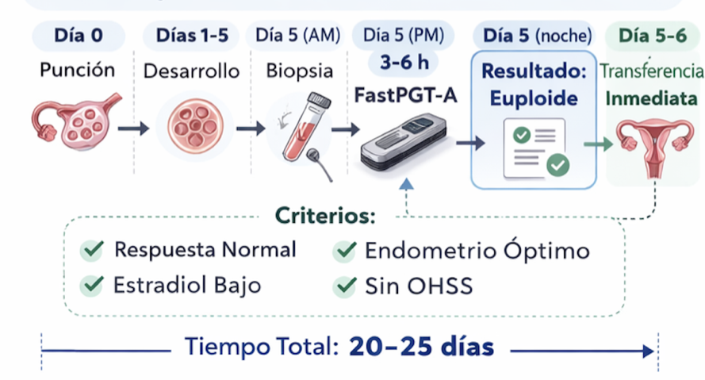
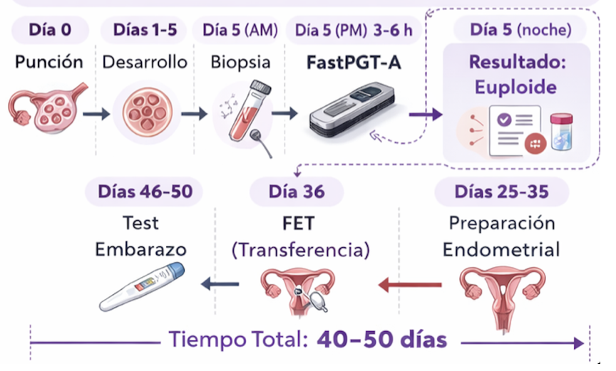

::: callout-note

## Links

**Insumos**: [Apéndice técnico](appendix-technical.qmd).

**Delivery 4**:  [Apéndice económico](appendix-economico/costsRBKRAA.qmd). [Documento Ppal](../index.qmd).
:::

# 1. Marco Clínico de FastPGT

FastPGT permite obtener resultados de eu/aneuploidía embrionaria en una ventana temporal que coincide con el mismo día de la biopsia (D5 post-punción). Esta reducción sustancial del tiempo diagnóstico modifica el paradigma operativo tradicional del PGT-A, en el cual los resultados demoran 10–14 días y obligan a un esquema universal de vitrificación y transferencia diferida.

La disponibilidad temprana del resultado no implica una única conducta clínica, sino que habilita al menos **dos estrategias diferenciadas**, las cuales pueden seleccionarse en función del perfil endocrino, endometrial y clínico de la paciente:

- Transferencia embrionaria en fresco (mismo ciclo).
- Freeze-all modificado (ciclo diferido optimizado).

La elección no es tecnológica sino médica, basada en criterios objetivos y preferencias informadas.

::: callout-important

En los ciclos de IVF sin PGT, la transferencia en fresco (FET) constituye una práctica ampliamente establecida. La introducción del PGT-A convencional transformó este paradigma al imponer un esquema universal de vitrificación debido a limitaciones temporales del diagnóstico. FastPGT-A restituye la posibilidad de transferencia en fresco en el contexto de evaluación genética, reintroduciendo una estrategia fisiológica previamente desplazada.

:::

---

# 2. Transferencia Embrionaria en Fresco (FET)

## 2.1 Concepto

Consiste en realizar la transferencia embrionaria el mismo día o dentro de las 24 horas posteriores a la obtención del resultado genético, aprovechando la ventana fisiológica de implantación del ciclo estimulado.

Esta estrategia es posible únicamente cuando el diagnóstico genético se obtiene dentro de una ventana compatible con la sincronía embrión–endometrio.

::::::::: {#fig-fastpgt}
::: {.column width="100%"}
{width="80%"} 
:::
:::::::::

---

## 2.2 Timeline estimado

- Día 0: Punción ovárica  
- Días 1–5: Desarrollo embrionario  
- Día 5 (mañana): Biopsia + preparación de librerías  
- Día 5 (tarde): Secuenciación + resultado  
- Día 6: Transferencia en fresco  
- Día 16–20: Test de embarazo  

**Duración total estimada:** ~20–25 días desde punción hasta test.

---

## 2.3 Criterios clínicos orientativos

Indicadores favorables:

- Respuesta ovárica normal o moderada  
- Estradiol en trigger < 3,500–4,000 pg/mL  
- Grosor endometrial 7–12 mm con patrón trilaminar  
- Ausencia de riesgo clínico de OHSS  (Ovarian hyperstimulation syndrome)
- ≥1 embrión euploide confirmado  
- Sin historia de falla de implantación recurrente  

Contraindicaciones relativas:

- Alta respuesta ovárica (>20 ovocitos)  
- Estradiol elevado  
- Riesgo de OHSS  
- Endometrio subóptimo  

---

## 2.4 Potenciales ventajas

### Clínicas

- **Sincronía embrión–endometrio fisiológica**
- Desarrollo embrionario continuo (sin vitrificación)
- Reducción de manipulaciones
- Tiempo a embarazo minimizado

### Operativas

- Eliminación de vitrificación y warming
- Simplificación del flujo asistencial
- Reducción de ciclos diferidos

### Económicas

- Evita costos de vitrificación y FET
- Reducción indirecta de carga operativa
- Posible reducción de insumos de congelamiento de embriones (mediano plazo)

---

## 2.5 Riesgos y limitaciones

### Fisiológicos

- Posible alteración de receptividad endometrial en ciclos con estradiol elevado
- Evidencia mixta en literatura respecto a comparación con FET

### Logísticos

- Necesidad de coordinación estricta en el mismo momento posterior a la biopsia.
- Ventana estrecha de decisión clínica.

### Clínicos

- No aplicable a todos los perfiles
- Requiere validación robusta del método rápido

---

# 3. Freeze-All Modificado (FET Optimizado)

## 3.1 Concepto

Consiste en vitrificar únicamente los embriones euploides identificados el día 5 y realizar transferencia en un ciclo posterior con preparación endometrial optimizada.

La diferencia respecto al protocolo tradicional es que la información genética está disponible inmediatamente, eliminando la espera de 10–14 días.

::::::::: {#fig-fastpgt}
::: {.column width="100%"}
{width="80%"} 
:::
:::::::::

---

## 3.2 Timeline estimado

- Día 0: Punción  
- Día 5: Biopsia + resultado + vitrificación selectiva  
- Días 6–25: Recuperación  
- Días 26–35: Preparación endometrial  
- Día 36: FET  
- Día 46–50: Test  

**Duración total estimada:** ~40–50 días.

En comparación con protocolos tradicionales diferidos (60–70 días), se reduce el tiempo total en aproximadamente 2–3 semanas.

---

## 3.3 Indicaciones frecuentes

- Alta respuesta ovárica  
- Estradiol elevado  
- Riesgo de OHSS  
- Endometrio subóptimo  
- Historia de falla de implantación  
- Preferencia por mayor control del timing  

---

## 3.4 Ventajas

### Clínicas

- Endometrio preparado en entorno hormonal controlado
- Eliminación de riesgo de OHSS
- Mayor flexibilidad para estudios adicionales (ERA, etc.)
- Certeza de euploidía antes de FET

### Operativas

- Mayor control de agenda clínica
- Distribución de carga de trabajo
- Vitrificación selectiva

---

## 3.5 Limitaciones

- Mayor tiempo total hasta embarazo
- Requiere ciclo adicional
- Manipulación embrionaria adicional (vitrificación/warming)
- Costos asociados a FET

---

# 4. Comparación Estratégica

| Aspecto | Pathway A (Fresco) | Pathway B (Freeze-All Modificado) |
|----------|------------------|------------------------------------|
| Tiempo total | 20–25 días | 40–50 días |
| Riesgo OHSS | Potencial en alta respuesta | Evitado |
| Manipulación embrionaria | Mínima | Vitrificación + warming |
| Flexibilidad clínica | Baja | Alta |
| Receptividad endometrial | Dependiente del ciclo estimulado | Optimizada |

No existe una estrategia universalmente superior; la indicación es individualizada.

---

# 5. Ventaja Estratégica de FastPGT-A

El protocolo tradicional impone freeze-all por limitación temporal diagnóstica.

FastPGT-A elimina esa restricción y permite que la decisión clínica el día 5 se base en:

1. Resultado genético
2. Estado endometrial
3. Riesgo clínico
4. Preferencia informada del paciente

El valor diferencial no es únicamente la velocidad, sino la **recuperación de la individualización terapéutica**.

---

# 6. Consideraciones Éticas

En el contexto argentino no existe legislación específica sobre descarte de embriones aneuploides.

La práctica clínica habitual es no transferir embriones con aneuploidías completas por su baja probabilidad de viabilidad. No obstante, el paciente puede solicitar criopreservación por razones éticas personales, asumiendo costos asociados.

La decisión debe basarse en consentimiento informado claro y documentado.

---

# 7. Conclusión

FastPGT-A transforma el PGT-A de un procedimiento forzosamente diferido en una herramienta diagnóstica con opciones clínicas adaptativas.

Su implementación adecuada permite:

- Reducción sustancial del tiempo hasta la transferencia.
- Optimización del flujo asistencial.
- Mayor personalización terapéutica.
- Potencial mejora en experiencia del paciente.

La validación clínica prospectiva y el seguimiento sistemático de resultados son esenciales para consolidar su integración en la práctica reproductiva.