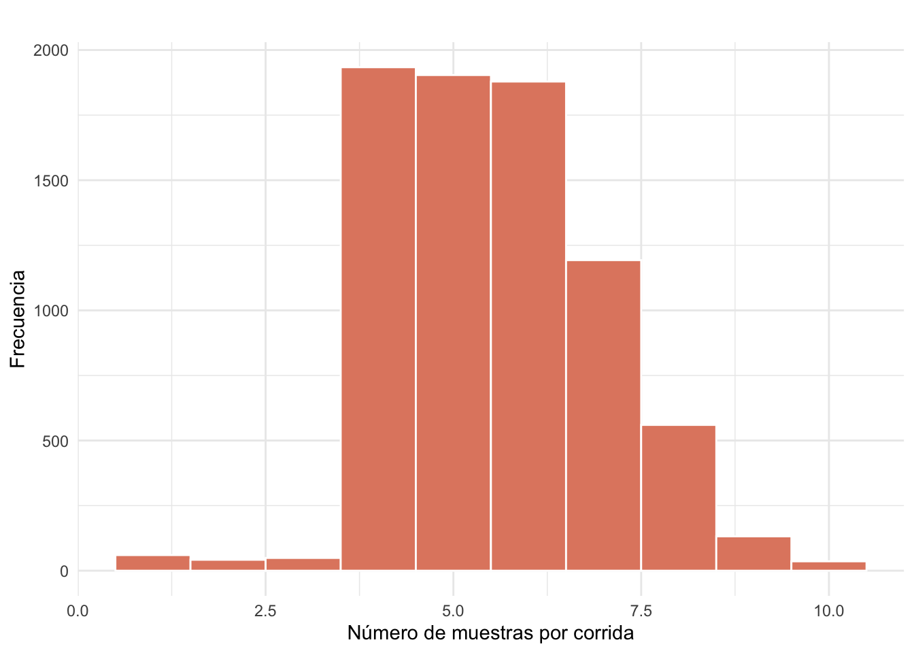
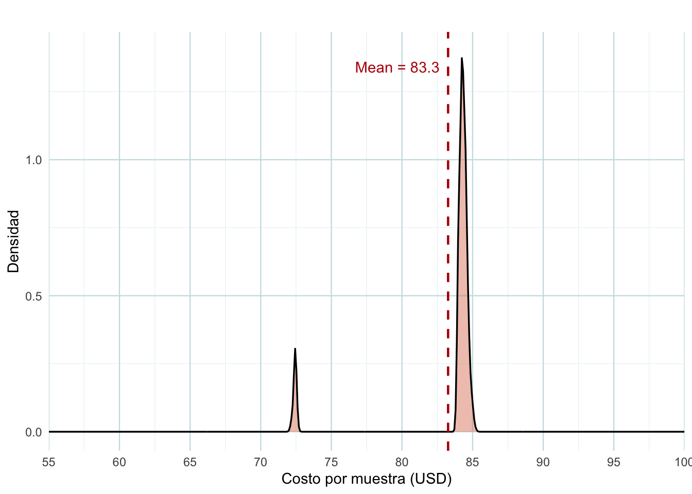
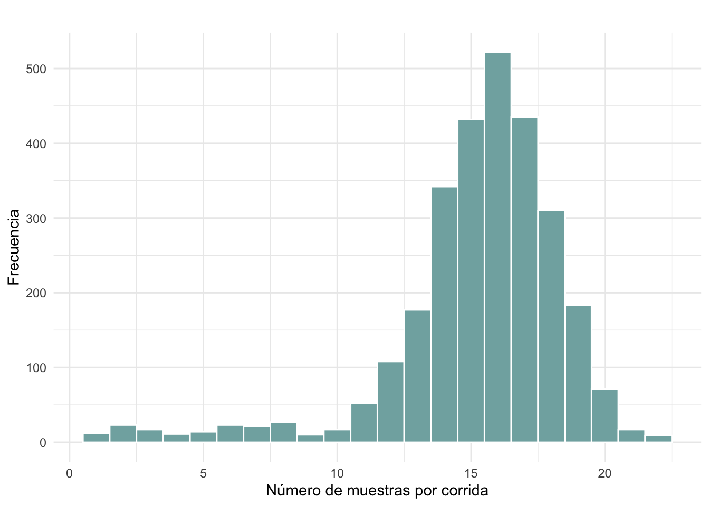
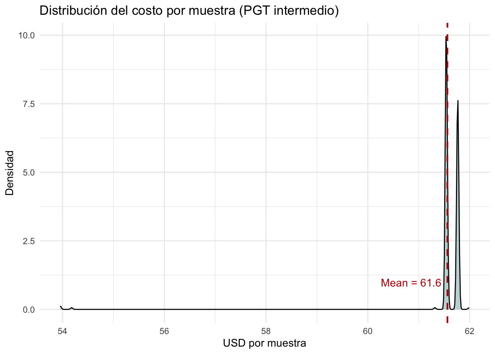
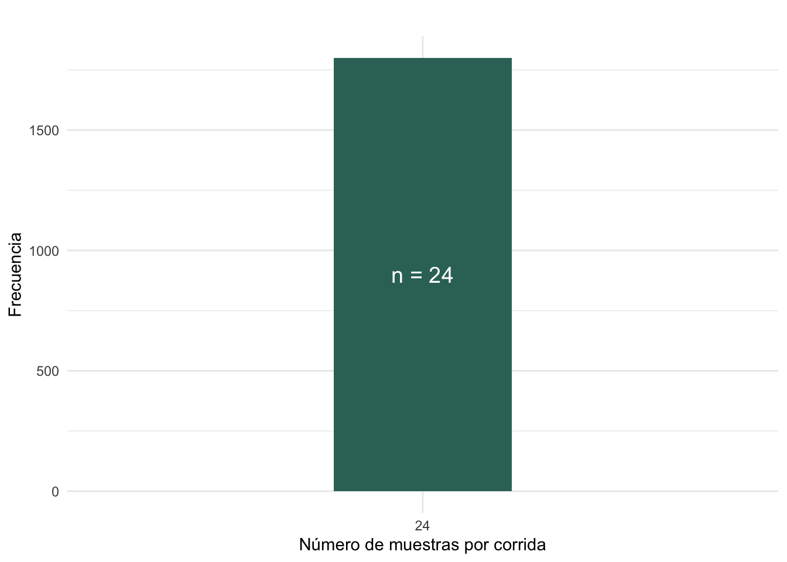
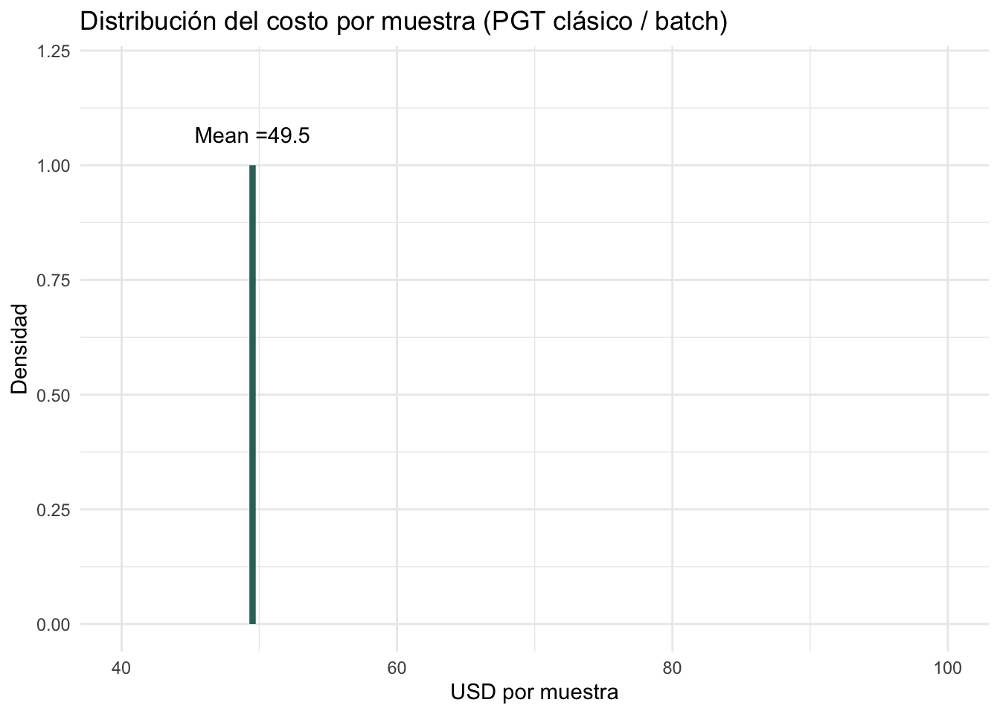
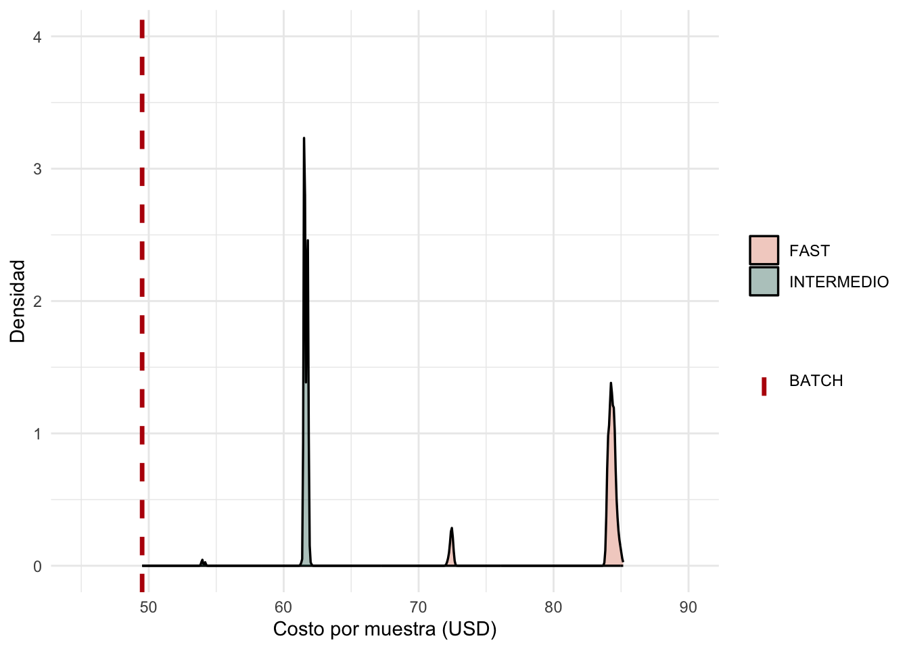

::: callout-note
## Links

**Presupuestos**: [Apéndice económico](appendix-costsRBKRAA.qmd)

**Delivery 4**:  [Documento Principal](/index.html)
:::

---


## 1. Simulación de costos en corridas de baja densidad (FastPGT)

A continuación modelamos el uso completo de un kit Rapid Barcoding (RBK) con capacidad total de 144 muestras bajo un régimen operativo FAST.

A diferencia de los modelos determinísticos previos, las corridas no se consideran independientes, sino que forman una secuencia acumulativa tal que:

$$
\sum_{i=1}^{R} n_i = 144
$$

donde $n_i$ representa el número de muestras procesadas en la corrida $i$, y $R$ es el número total de corridas necesarias para consumir el kit completo.


### 1.1 Modelo de generación de corridas

El tamaño de cada corrida se modela como una variable aleatoria siguiendo una distribución normal truncada:

$$
n_i \sim \mathcal{N}(\mu = 5.5,\ \sigma = 1.5), \quad n_i \in [4,10]
$$

Esta elección refleja un régimen clínico más realista que una distribución uniforme, donde:

- la mayoría de las corridas se concentran en tamaños intermedios (5–6 muestras),
- los valores extremos (corridas muy pequeñas o grandes) son menos frecuentes,
- existe variabilidad inherente en la llegada de muestras.

La secuencia de corridas se genera iterativamente hasta alcanzar exactamente 144 muestras, ajustando la última corrida si es necesario para cumplir esta restricción.


::: callout-note

El objetivo de esta simulación es:

- estimar el costo promedio por muestra bajo condiciones realistas,
- cuantificar la variabilidad del sistema,
- identificar escenarios de mayor y menor eficiencia,
- analizar el impacto de la fragmentación de corridas sobre el costo.

 - Este enfoque proporciona una representación más fiel del comportamiento operativo del sistema FastPGT en condiciones clínicas reales.

 - Se realizaron **300 simulaciones independientes**, cada una correspondiente a un ciclo completo de consumo de un kit RBK (144 barcodes), modelado como una secuencia de corridas hasta alcanzar dicha capacidad.

::: 


### 1.2 Naturaleza estocástica del modelo

Dado que la generación de $n_i$ es aleatoria, cada simulación produce:

- un número distinto de corridas $R$,
- un número variable de flow cells utilizados,
- una estructura diferente de eventos (lavados, cambios de FC, uso de RAA).

Por lo tanto, el costo por muestra emerge como una variable aleatoria:

$$
C_{\text{muestra}} \sim f(\{n_i\})
$$

donde $f$ representa la dinámica completa del sistema.

Este enfoque permite capturar la variabilidad real del proceso y evaluar no solo el costo esperado, sino también su dispersión y escenarios extremos.


----

### Distribución de muestras por corrida (simulación)


::: {.cell}
::: {.cell-output-display}
{width=672}
:::
:::


La distribución observada presenta una forma aproximadamente normal, centrada en 5–6 muestras por corrida, con límites entre 4 y 10.

Esto refleja adecuadamente la variabilidad clínica esperada, donde:

- la mayoría de las corridas son de tamaño pequeño,
- los extremos (corridas muy pequeñas o grandes) son menos frecuentes.

La ligera distorsión en los valores bajos se debe al ajuste del último run para completar exactamente 144 muestras.

----

### Resumen de costos


::: {.cell}
::: {.cell-output-display}


Table: Resumen estadístico del costo por muestra en FastPGT

| Costo min (USD) | Costo medio (USD) | Desvío estándar |  P10  |  P90  | Costo max (USD) |
|:---------------:|:-----------------:|:---------------:|:-----:|:-----:|:---------------:|
|      72.23      |       83.27       |      3.42       | 84.04 | 84.71 |      85.16      |


:::
:::


La tabla muestra que:

- El costo por muestra en el modelo FastPGT bajo condiciones realistas muestra un valor medio de aproximadamente **83.6 USD**, con una variabilidad moderada (desvío estándar de 3.08 USD). 

- La distribución se concentra en un rango relativamente estrecho, con valores entre 84 y 84.7 USD para los percentiles 10 y 90, lo que indica un comportamiento operativo bastante estable en la mayoría de los escenarios. 

- Se observan valores mínimos cercanos a 72.2 USD, correspondientes a configuraciones altamente eficientes, y máximos que alcanzan 96.7 USD en escenarios más fragmentados. 

- En conjunto, **estos resultados confirman que el costo por muestra no es fijo, sino que depende de la estructura de corridas y del aprovechamiento de los recursos del sistema**.


----

### Resumen de valores operativos


::: {.cell}
::: {.cell-output-display}


Table: Resumen operativo del sistema (corridas y uso de flow cells)

| Corridas (min) | Corridas (p90) | Corridas (max) | FC (min) | FC (p90) | FC (max) |
|:--------------:|:--------------:|:--------------:|:--------:|:--------:|:--------:|
|       23       |       28       |       30       |    4     |    5     |    5     |


:::
:::


La tabla muestra que:

- Desde el punto de vista operativo, el sistema requiere un mínimo de 23 corridas para consumir completamente un kit RBK, pudiendo alcanzar hasta 31 en escenarios más fragmentados, con un percentil 90 en torno a 28 corridas. 

- Esta variabilidad se traduce directamente en el uso de flow cells, con un mínimo de 4 y un máximo de 6, siendo 5 el valor más frecuente en condiciones típicas. 

- Estos resultados reflejan la **naturaleza discreta del sistema**, donde pequeñas variaciones en el tamaño de las corridas impactan significativamente en el número total de ciclos necesarios y, en consecuencia, en la eficiencia global del proceso.

----

### Distribución del costo por muestra


::: {.cell}
::: {.cell-output-display}
{width=672}
:::
:::


La distribución del costo presenta dos características relevantes:

1. **Un pico principal (~83–84 USD)**  
   Representa el régimen operativo típico bajo condiciones realistas.

2. **Un pico secundario a menor costo (~70–72 USD)**  
   Corresponde a escenarios excepcionalmente eficientes, en los que:

   - el número total de corridas es menor,
   - el número de flow cells utilizados se reduce,
   - la fragmentación de muestras es menor,
   - el aprovechamiento de recursos es más cercano al óptimo.

Este comportamiento multimodal surge de la naturaleza discreta del sistema, en particular:

- el reemplazo de flow cells cada 6 corridas,
- el uso condicionado de reactivos (RAA, wash),
- la estructura secuencial de las corridas.

---

::: callout-note

### Interpretación global

Los resultados muestran que el costo por muestra no es un valor fijo, sino una variable emergente dependiente de la organización de las corridas.

En particular:

- una mayor fragmentación (corridas pequeñas frecuentes) aumenta el costo,
- una mejor agrupación de muestras reduce significativamente el costo,
- existen escenarios de alta eficiencia, aunque no representan el comportamiento promedio.

Esto confirma que el sistema FastPGT está gobernado por dinámicas operativas discretas, más que por una relación lineal entre insumos y muestras procesadas.


### Implicancias operativas

Este análisis permite:

- cuantificar el impacto económico de la variabilidad clínica,
- identificar condiciones de operación eficientes,
- fundamentar estrategias de optimización, como:
  - establecimiento de tamaños mínimos de corrida,
  - agrupamiento parcial de muestras,
  - planificación del uso de flow cells.

En conjunto, el modelo proporciona una herramienta robusta para la toma de decisiones operativas y económicas en entornos de PGT rápido.

:::

---

## 2. Simulación bajo régimen intermedio


La secuencia de corridas se define como:

$$
\sum_{i=1}^{R} n_i = 144
$$

donde:

$R$ es el número total de corridas, y $n_i$ es el número de muestras por corrida, la cual tiene las siguientes propiedades:

$$
n_i \sim \mathcal{N}(\mu = 16,\ \sigma = 2), \quad n_i \in [11,22]
$$

Este modelo refleja condiciones operativas donde las muestras se agrupan antes de ser procesadas, optimizando el uso de recursos.


::: {.cell}

:::


### Tabla de Costos


::: {.cell}
::: {.cell-output-display}


Table: Resumen de costos bajo régimen intermedio

| Costo medio (USD) | Desvío estándar | P10  | Mediana (P50) | P90  |
|:-----------------:|:---------------:|:----:|:-------------:|:----:|
|       61.6        |      0.77       | 61.5 |     61.5      | 61.8 |


:::
:::


### Tabla de Operación


::: {.cell}
::: {.cell-output-display}


Table: Resumen operativo bajo régimen intermedio

| Corridas (min) | Corridas (mediana) | Corridas (p90) | Corridas (max) | FC (min) | FC (mediana) | FC (p90) | FC (max) |
|:--------------:|:------------------:|:--------------:|:--------------:|:--------:|:------------:|:--------:|:--------:|
|       8        |         9          |       10       |       11       |    3     |      4       |    4     |    4     |


:::
:::


### Distribución de muestras por corrida (PGT intermedio)


::: {.cell}
::: {.cell-output-display}
{width=672}
:::
:::


### Gráfico de Costos


::: {.cell}
::: {.cell-output-display}
{width=672}
:::
:::


----

## 3. Simulación bajo régimen PGT clásico / batch

En este escenario se modela un régimen operativo con corridas de mayor tamaño, representativo de un flujo de trabajo tipo batch.

A diferencia del régimen FAST, las corridas presentan menor fragmentación y un mayor número de muestras por corrida.

La secuencia de corridas se define como en el escenario anterior.

donde:

$$
n_i \sim \mathcal{N}(\mu = 24,\ \sigma = 0), \quad n_i \in [24,24]
$$

Este modelo refleja condiciones operativas donde las muestras se agrupan antes de ser procesadas, optimizando el uso de recursos.


::: {.cell}

:::


### Tabla de Costos


::: {.cell}
::: {.cell-output-display}


Table: Resumen de costos bajo régimen batch (PGT estándar)

| Costo medio (USD) | Desvío estándar | P10  | Mediana (P50) | P90  |
|:-----------------:|:---------------:|:----:|:-------------:|:----:|
|       49.5        |        0        | 49.5 |     49.5      | 49.5 |


:::
:::


### Tabla de Operación


::: {.cell}
::: {.cell-output-display}


Table: Resumen operativo bajo régimen batch

| Corridas (min) | Corridas (mediana) | Corridas (p90) | Corridas (max) | FC (min) | FC (mediana) | FC (p90) | FC (max) |
|:--------------:|:------------------:|:--------------:|:--------------:|:--------:|:------------:|:--------:|:--------:|
|       6        |         6          |       6        |       6        |    3     |      3       |    3     |    3     |


:::
:::


### Distribución de muestras por corrida (PGT estándar)


::: {.cell}
::: {.cell-output-display}
{width=672}
:::
:::


### Gráfico de Costos


::: {.cell}
::: {.cell-output-display}
{width=672}
:::
:::


### Interpretación del régimen PGT clásico o batch

El régimen batch presenta una reducción significativa en la variabilidad del sistema, con un menor número de corridas necesarias para consumir un kit RBK y, en consecuencia, un menor número de flow cells utilizados.

La distribución del costo en el régimen batch presenta una varianza extremadamente baja, lo que hace que la estimación de densidad  resulte poco informativa. Por este motivo, se utilizan representaciones basadas en histogramas, que reflejan mejor la concentración de valores.

El aumento en el tamaño promedio de corrida reduce la fragmentación del proceso, lo que se traduce en una mayor eficiencia económica y una disminución del costo por muestra.

::: callout-note

## Comparación del costos por muestra: FAST vs Intermedio vs PGT clásico

- En comparación con el régimen FAST, el escenario e intermedio representan un comportamiento más estable y predecible, con una la reducción de costos importantes, y curiosamnete, no tan diferentes, lo cual genera una ventaja operacional importante: **No hay mucha diferencia entre los costos BATCH vs INTERMEDIO** lo cual relaja la decisión del laboratorio sobre qué procedimiento y cuanto tiempo deben esperar las muestras.


::: {.cell}
::: {.cell-output-display}
{width=672}
:::
:::


:::


----
## 4. Tabla de simulaciones

### 4.1. FastPGT

The full simulation output contains 23 variables capturing operational and economic states. 
For clarity, a reduced subset of key variables is presented here.


::: {.cell}
::: {.cell-output-display}
`````{=html}
<table class="table" style="width: auto !important; margin-left: auto; margin-right: auto;">
<caption>Resumen de simulación</caption>
 <thead>
  <tr>
   <th style="text-align:left;"> Run </th>
   <th style="text-align:left;"> Samples </th>
   <th style="text-align:left;"> Total Samples </th>
   <th style="text-align:left;"> RBK # </th>
   <th style="text-align:left;"> RBK Cycle </th>
   <th style="text-align:left;"> RAA Cycle </th>
   <th style="text-align:left;"> Flow Cell # </th>
   <th style="text-align:left;"> Event </th>
   <th style="text-align:left;"> Run Cost (USD) </th>
   <th style="text-align:left;"> Cumulative Cost (USD) </th>
   <th style="text-align:left;"> Avg Cost / Sample (USD) </th>
  </tr>
 </thead>
<tbody>
  <tr>
   <td style="text-align:left;"> 1 </td>
   <td style="text-align:left;"> 4.00 </td>
   <td style="text-align:left;"> 4 </td>
   <td style="text-align:left;"> 1 </td>
   <td style="text-align:left;"> 1 </td>
   <td style="text-align:left;"> 0 </td>
   <td style="text-align:left;"> 1 </td>
   <td style="text-align:left;"> Arranca_RBK </td>
   <td style="text-align:left;"> 205.46 </td>
   <td style="text-align:left;"> 2,968.00 </td>
   <td style="text-align:left;"> 742.00 </td>
  </tr>
  <tr>
   <td style="text-align:left;"> 2 </td>
   <td style="text-align:left;"> 4.00 </td>
   <td style="text-align:left;"> 8 </td>
   <td style="text-align:left;"> 1 </td>
   <td style="text-align:left;"> 2 </td>
   <td style="text-align:left;"> 0 </td>
   <td style="text-align:left;"> 1 </td>
   <td style="text-align:left;"> Wash </td>
   <td style="text-align:left;"> 237.79 </td>
   <td style="text-align:left;"> 3,000.33 </td>
   <td style="text-align:left;"> 375.04 </td>
  </tr>
  <tr>
   <td style="text-align:left;"> 3 </td>
   <td style="text-align:left;"> 5.00 </td>
   <td style="text-align:left;"> 13 </td>
   <td style="text-align:left;"> 1 </td>
   <td style="text-align:left;"> 3 </td>
   <td style="text-align:left;"> 0 </td>
   <td style="text-align:left;"> 1 </td>
   <td style="text-align:left;"> Wash </td>
   <td style="text-align:left;"> 289.16 </td>
   <td style="text-align:left;"> 3,032.67 </td>
   <td style="text-align:left;"> 233.28 </td>
  </tr>
  <tr>
   <td style="text-align:left;"> 4 </td>
   <td style="text-align:left;"> 7.00 </td>
   <td style="text-align:left;"> 20 </td>
   <td style="text-align:left;"> 1 </td>
   <td style="text-align:left;"> 4 </td>
   <td style="text-align:left;"> 0 </td>
   <td style="text-align:left;"> 1 </td>
   <td style="text-align:left;"> Wash </td>
   <td style="text-align:left;"> 391.89 </td>
   <td style="text-align:left;"> 3,065.00 </td>
   <td style="text-align:left;"> 153.25 </td>
  </tr>
  <tr>
   <td style="text-align:left;"> 5 </td>
   <td style="text-align:left;"> 8.00 </td>
   <td style="text-align:left;"> 28 </td>
   <td style="text-align:left;"> 1 </td>
   <td style="text-align:left;"> 5 </td>
   <td style="text-align:left;"> 0 </td>
   <td style="text-align:left;"> 1 </td>
   <td style="text-align:left;"> Wash </td>
   <td style="text-align:left;"> 443.26 </td>
   <td style="text-align:left;"> 3,097.33 </td>
   <td style="text-align:left;"> 110.62 </td>
  </tr>
  <tr>
   <td style="text-align:left;"> 6 </td>
   <td style="text-align:left;"> 7.00 </td>
   <td style="text-align:left;"> 35 </td>
   <td style="text-align:left;"> 1 </td>
   <td style="text-align:left;"> 6 </td>
   <td style="text-align:left;"> 0 </td>
   <td style="text-align:left;"> 1 </td>
   <td style="text-align:left;"> Wash </td>
   <td style="text-align:left;"> 391.89 </td>
   <td style="text-align:left;"> 3,129.67 </td>
   <td style="text-align:left;"> 89.42 </td>
  </tr>
  <tr>
   <td style="text-align:left;"> 7 </td>
   <td style="text-align:left;"> 7.00 </td>
   <td style="text-align:left;"> 42 </td>
   <td style="text-align:left;"> 1 </td>
   <td style="text-align:left;"> 7 </td>
   <td style="text-align:left;"> 1 </td>
   <td style="text-align:left;"> 2 </td>
   <td style="text-align:left;"> Nuevo FC + Compra RAA </td>
   <td style="text-align:left;"> 450.06 </td>
   <td style="text-align:left;"> 4,797.67 </td>
   <td style="text-align:left;"> 114.23 </td>
  </tr>
  <tr>
   <td style="text-align:left;"> 8 </td>
   <td style="text-align:left;"> 7.00 </td>
   <td style="text-align:left;"> 49 </td>
   <td style="text-align:left;"> 1 </td>
   <td style="text-align:left;"> 8 </td>
   <td style="text-align:left;"> 2 </td>
   <td style="text-align:left;"> 2 </td>
   <td style="text-align:left;"> Wash </td>
   <td style="text-align:left;"> 482.39 </td>
   <td style="text-align:left;"> 4,830.00 </td>
   <td style="text-align:left;"> 98.57 </td>
  </tr>
  <tr>
   <td style="text-align:left;"> 9 </td>
   <td style="text-align:left;"> 4.00 </td>
   <td style="text-align:left;"> 53 </td>
   <td style="text-align:left;"> 1 </td>
   <td style="text-align:left;"> 9 </td>
   <td style="text-align:left;"> 3 </td>
   <td style="text-align:left;"> 2 </td>
   <td style="text-align:left;"> Wash </td>
   <td style="text-align:left;"> 328.29 </td>
   <td style="text-align:left;"> 4,862.33 </td>
   <td style="text-align:left;"> 91.74 </td>
  </tr>
  <tr>
   <td style="text-align:left;"> 10 </td>
   <td style="text-align:left;"> 7.00 </td>
   <td style="text-align:left;"> 60 </td>
   <td style="text-align:left;"> 1 </td>
   <td style="text-align:left;"> 10 </td>
   <td style="text-align:left;"> 4 </td>
   <td style="text-align:left;"> 2 </td>
   <td style="text-align:left;"> Wash </td>
   <td style="text-align:left;"> 482.39 </td>
   <td style="text-align:left;"> 4,894.67 </td>
   <td style="text-align:left;"> 81.58 </td>
  </tr>
  <tr>
   <td style="text-align:left;"> 11 </td>
   <td style="text-align:left;"> 7.00 </td>
   <td style="text-align:left;"> 67 </td>
   <td style="text-align:left;"> 1 </td>
   <td style="text-align:left;"> 11 </td>
   <td style="text-align:left;"> 5 </td>
   <td style="text-align:left;"> 2 </td>
   <td style="text-align:left;"> Wash </td>
   <td style="text-align:left;"> 482.39 </td>
   <td style="text-align:left;"> 4,927.00 </td>
   <td style="text-align:left;"> 73.54 </td>
  </tr>
  <tr>
   <td style="text-align:left;"> 12 </td>
   <td style="text-align:left;"> 6.00 </td>
   <td style="text-align:left;"> 73 </td>
   <td style="text-align:left;"> 1 </td>
   <td style="text-align:left;"> 12 </td>
   <td style="text-align:left;"> 6 </td>
   <td style="text-align:left;"> 2 </td>
   <td style="text-align:left;"> Wash </td>
   <td style="text-align:left;"> 431.02 </td>
   <td style="text-align:left;"> 4,959.33 </td>
   <td style="text-align:left;"> 67.94 </td>
  </tr>
  <tr>
   <td style="text-align:left;"> 13 </td>
   <td style="text-align:left;"> 7.00 </td>
   <td style="text-align:left;"> 80 </td>
   <td style="text-align:left;"> 1 </td>
   <td style="text-align:left;"> 13 </td>
   <td style="text-align:left;"> 1 </td>
   <td style="text-align:left;"> 3 </td>
   <td style="text-align:left;"> Nuevo FC + Compra RAA </td>
   <td style="text-align:left;"> 450.06 </td>
   <td style="text-align:left;"> 6,627.33 </td>
   <td style="text-align:left;"> 82.84 </td>
  </tr>
  <tr>
   <td style="text-align:left;"> 14 </td>
   <td style="text-align:left;"> 4.00 </td>
   <td style="text-align:left;"> 84 </td>
   <td style="text-align:left;"> 1 </td>
   <td style="text-align:left;"> 14 </td>
   <td style="text-align:left;"> 2 </td>
   <td style="text-align:left;"> 3 </td>
   <td style="text-align:left;"> Wash </td>
   <td style="text-align:left;"> 328.29 </td>
   <td style="text-align:left;"> 6,659.67 </td>
   <td style="text-align:left;"> 79.28 </td>
  </tr>
  <tr>
   <td style="text-align:left;"> 15 </td>
   <td style="text-align:left;"> 7.00 </td>
   <td style="text-align:left;"> 91 </td>
   <td style="text-align:left;"> 1 </td>
   <td style="text-align:left;"> 15 </td>
   <td style="text-align:left;"> 3 </td>
   <td style="text-align:left;"> 3 </td>
   <td style="text-align:left;"> Wash </td>
   <td style="text-align:left;"> 482.39 </td>
   <td style="text-align:left;"> 6,692.00 </td>
   <td style="text-align:left;"> 73.54 </td>
  </tr>
  <tr>
   <td style="text-align:left;"> 16 </td>
   <td style="text-align:left;"> 7.00 </td>
   <td style="text-align:left;"> 98 </td>
   <td style="text-align:left;"> 1 </td>
   <td style="text-align:left;"> 16 </td>
   <td style="text-align:left;"> 4 </td>
   <td style="text-align:left;"> 3 </td>
   <td style="text-align:left;"> Wash + Compra WGA </td>
   <td style="text-align:left;"> 482.39 </td>
   <td style="text-align:left;"> 8,538.73 </td>
   <td style="text-align:left;"> 87.13 </td>
  </tr>
  <tr>
   <td style="text-align:left;"> 17 </td>
   <td style="text-align:left;"> 6.00 </td>
   <td style="text-align:left;"> 104 </td>
   <td style="text-align:left;"> 1 </td>
   <td style="text-align:left;"> 17 </td>
   <td style="text-align:left;"> 5 </td>
   <td style="text-align:left;"> 3 </td>
   <td style="text-align:left;"> Wash </td>
   <td style="text-align:left;"> 431.02 </td>
   <td style="text-align:left;"> 8,571.07 </td>
   <td style="text-align:left;"> 82.41 </td>
  </tr>
  <tr>
   <td style="text-align:left;"> 18 </td>
   <td style="text-align:left;"> 6.00 </td>
   <td style="text-align:left;"> 110 </td>
   <td style="text-align:left;"> 1 </td>
   <td style="text-align:left;"> 18 </td>
   <td style="text-align:left;"> 6 </td>
   <td style="text-align:left;"> 3 </td>
   <td style="text-align:left;"> Wash </td>
   <td style="text-align:left;"> 431.02 </td>
   <td style="text-align:left;"> 8,603.40 </td>
   <td style="text-align:left;"> 78.21 </td>
  </tr>
  <tr>
   <td style="text-align:left;"> 19 </td>
   <td style="text-align:left;"> 5.00 </td>
   <td style="text-align:left;"> 115 </td>
   <td style="text-align:left;"> 1 </td>
   <td style="text-align:left;"> 19 </td>
   <td style="text-align:left;"> 1 </td>
   <td style="text-align:left;"> 4 </td>
   <td style="text-align:left;"> Nuevo FC + Compra RAA </td>
   <td style="text-align:left;"> 347.33 </td>
   <td style="text-align:left;"> 10,271.40 </td>
   <td style="text-align:left;"> 89.32 </td>
  </tr>
  <tr>
   <td style="text-align:left;"> 20 </td>
   <td style="text-align:left;"> 4.00 </td>
   <td style="text-align:left;"> 119 </td>
   <td style="text-align:left;"> 1 </td>
   <td style="text-align:left;"> 20 </td>
   <td style="text-align:left;"> 2 </td>
   <td style="text-align:left;"> 4 </td>
   <td style="text-align:left;"> Wash </td>
   <td style="text-align:left;"> 328.29 </td>
   <td style="text-align:left;"> 10,303.73 </td>
   <td style="text-align:left;"> 86.59 </td>
  </tr>
  <tr>
   <td style="text-align:left;"> 21 </td>
   <td style="text-align:left;"> 7.00 </td>
   <td style="text-align:left;"> 126 </td>
   <td style="text-align:left;"> 1 </td>
   <td style="text-align:left;"> 21 </td>
   <td style="text-align:left;"> 3 </td>
   <td style="text-align:left;"> 4 </td>
   <td style="text-align:left;"> Wash </td>
   <td style="text-align:left;"> 482.39 </td>
   <td style="text-align:left;"> 10,336.07 </td>
   <td style="text-align:left;"> 82.03 </td>
  </tr>
  <tr>
   <td style="text-align:left;"> 22 </td>
   <td style="text-align:left;"> 5.00 </td>
   <td style="text-align:left;"> 131 </td>
   <td style="text-align:left;"> 1 </td>
   <td style="text-align:left;"> 22 </td>
   <td style="text-align:left;"> 4 </td>
   <td style="text-align:left;"> 4 </td>
   <td style="text-align:left;"> Wash </td>
   <td style="text-align:left;"> 379.66 </td>
   <td style="text-align:left;"> 10,368.40 </td>
   <td style="text-align:left;"> 79.15 </td>
  </tr>
  <tr>
   <td style="text-align:left;"> 23 </td>
   <td style="text-align:left;"> 6.00 </td>
   <td style="text-align:left;"> 137 </td>
   <td style="text-align:left;"> 1 </td>
   <td style="text-align:left;"> 23 </td>
   <td style="text-align:left;"> 5 </td>
   <td style="text-align:left;"> 4 </td>
   <td style="text-align:left;"> Wash </td>
   <td style="text-align:left;"> 431.02 </td>
   <td style="text-align:left;"> 10,400.73 </td>
   <td style="text-align:left;"> 75.92 </td>
  </tr>
  <tr>
   <td style="text-align:left;"> 24 </td>
   <td style="text-align:left;"> 5.00 </td>
   <td style="text-align:left;"> 142 </td>
   <td style="text-align:left;"> 1 </td>
   <td style="text-align:left;"> 24 </td>
   <td style="text-align:left;"> 6 </td>
   <td style="text-align:left;"> 4 </td>
   <td style="text-align:left;"> Wash </td>
   <td style="text-align:left;"> 379.66 </td>
   <td style="text-align:left;"> 10,433.07 </td>
   <td style="text-align:left;"> 73.47 </td>
  </tr>
  <tr>
   <td style="text-align:left;"> 25 </td>
   <td style="text-align:left;"> 2.00 </td>
   <td style="text-align:left;"> 144 </td>
   <td style="text-align:left;"> 1 </td>
   <td style="text-align:left;"> 25 </td>
   <td style="text-align:left;"> 1 </td>
   <td style="text-align:left;"> 5 </td>
   <td style="text-align:left;"> Nuevo FC + Compra RAA </td>
   <td style="text-align:left;"> 193.23 </td>
   <td style="text-align:left;"> 12,101.07 </td>
   <td style="text-align:left;"> 84.04 </td>
  </tr>
  <tr>
   <td style="text-align:left;font-weight: bold;background-color: rgba(239, 239, 239, 255) !important;"> NA </td>
   <td style="text-align:left;font-weight: bold;background-color: rgba(239, 239, 239, 255) !important;"> 5.76 </td>
   <td style="text-align:left;font-weight: bold;background-color: rgba(239, 239, 239, 255) !important;"> 144 </td>
   <td style="text-align:left;font-weight: bold;background-color: rgba(239, 239, 239, 255) !important;"> 1 </td>
   <td style="text-align:left;font-weight: bold;background-color: rgba(239, 239, 239, 255) !important;"> NA </td>
   <td style="text-align:left;font-weight: bold;background-color: rgba(239, 239, 239, 255) !important;"> NA </td>
   <td style="text-align:left;font-weight: bold;background-color: rgba(239, 239, 239, 255) !important;"> 5 </td>
   <td style="text-align:left;font-weight: bold;background-color: rgba(239, 239, 239, 255) !important;"> PROMEDIO </td>
   <td style="text-align:left;font-weight: bold;background-color: rgba(239, 239, 239, 255) !important;"> 390.51 </td>
   <td style="text-align:left;font-weight: bold;background-color: rgba(239, 239, 239, 255) !important;"> 12,101.07 </td>
   <td style="text-align:left;font-weight: bold;background-color: rgba(239, 239, 239, 255) !important;"> 84.04 </td>
  </tr>
</tbody>
</table>

`````
:::
:::


::: {.callout-note collapse="true"}
## Click to see the full simulation

This simulation output contains all operational state variables and is provided here for reproducibility.


::: {.cell}
::: {.cell-output-display}

```{=html}
<div class="datatables html-widget html-fill-item" id="htmlwidget-b7a2c37ee0f584ac8d5d" style="width:100%;height:auto;"></div>
<script type="application/json" data-for="htmlwidget-b7a2c37ee0f584ac8d5d">{"x":{"filter":"none","vertical":false,"data":[[1,2,3,4,5,6,7,8,9,10,11,12,13,14,15,16,17,18,19,20,21,22,23,24,25],[4,4,5,7,8,7,7,7,4,7,7,6,7,4,7,7,6,6,5,4,7,5,6,5,2],[4,8,13,20,28,35,42,49,53,60,67,73,80,84,91,98,104,110,115,119,126,131,137,142,144],[4,8,13,20,28,35,7,14,18,25,32,38,7,11,18,25,31,37,5,9,16,21,27,32,2],[1,1,1,1,1,1,2,2,2,2,2,2,3,3,3,3,3,3,4,4,4,4,4,4,5],["Arranca_RBK","Wash","Wash","Wash","Wash","Wash","Nuevo FC + Compra RAA","Wash","Wash","Wash","Wash","Wash","Nuevo FC + Compra RAA","Wash","Wash","Wash + Compra WGA","Wash","Wash","Nuevo FC + Compra RAA","Wash","Wash","Wash","Wash","Wash","Nuevo FC + Compra RAA"],[1,1,1,1,1,1,1,1,1,1,1,1,1,1,1,1,1,1,1,1,1,1,1,1,1],[1,2,3,4,5,6,7,8,9,10,11,12,13,14,15,16,17,18,19,20,21,22,23,24,25],[0,0,0,0,0,0,1,2,3,4,5,6,1,2,3,4,5,6,1,2,3,4,5,6,1],[0,0,0,0,0,0,1,1,1,1,1,1,2,2,2,2,2,2,3,3,3,3,3,3,4],[75.59999999999999,75.59999999999999,94.5,132.3,151.2,132.3,132.3,132.3,75.59999999999999,132.3,132.3,113.4,132.3,75.59999999999999,132.3,132.3,113.4,113.4,94.5,75.59999999999999,132.3,94.5,113.4,94.5,37.8],[93.75,93.75,117.1875,164.0625,187.5,164.0625,164.0625,164.0625,93.75,164.0625,164.0625,140.625,164.0625,93.75,164.0625,164.0625,140.625,140.625,117.1875,93.75,164.0625,117.1875,140.625,117.1875,46.875],[0,0,0,0,0,0,90.5,90.5,90.5,90.5,90.5,90.5,90.5,90.5,90.5,90.5,90.5,90.5,90.5,90.5,90.5,90.5,90.5,90.5,90.5],[36.11111111111111,36.11111111111111,45.13888888888889,63.19444444444445,72.22222222222223,63.19444444444445,63.19444444444445,63.19444444444445,36.11111111111111,63.19444444444445,63.19444444444445,54.16666666666667,63.19444444444445,36.11111111111111,63.19444444444445,63.19444444444445,54.16666666666667,54.16666666666667,45.13888888888889,36.11111111111111,63.19444444444445,45.13888888888889,54.16666666666667,45.13888888888889,18.05555555555556],[0,32.33333333333334,32.33333333333334,32.33333333333334,32.33333333333334,32.33333333333334,0,32.33333333333334,32.33333333333334,32.33333333333334,32.33333333333334,32.33333333333334,0,32.33333333333334,32.33333333333334,32.33333333333334,32.33333333333334,32.33333333333334,0,32.33333333333334,32.33333333333334,32.33333333333334,32.33333333333334,32.33333333333334,0],[18.9,18.9,18.9,18.9,18.9,18.9,18.9,18.9,18.9,18.9,18.9,18.9,18.9,18.9,18.9,18.9,18.9,18.9,18.9,18.9,18.9,18.9,18.9,18.9,18.9],[23.4375,23.4375,23.4375,23.4375,23.4375,23.4375,23.4375,23.4375,23.4375,23.4375,23.4375,23.4375,23.4375,23.4375,23.4375,23.4375,23.4375,23.4375,23.4375,23.4375,23.4375,23.4375,23.4375,23.4375,23.4375],[0,0,0,0,0,0,12.92857142857143,12.92857142857143,22.625,12.92857142857143,12.92857142857143,15.08333333333333,12.92857142857143,22.625,12.92857142857143,12.92857142857143,15.08333333333333,15.08333333333333,18.1,22.625,12.92857142857143,18.1,15.08333333333333,18.1,45.25],[9.027777777777779,9.027777777777779,9.027777777777779,9.027777777777779,9.027777777777779,9.027777777777779,9.027777777777779,9.027777777777779,9.027777777777779,9.027777777777779,9.027777777777779,9.027777777777779,9.027777777777779,9.027777777777779,9.027777777777779,9.027777777777779,9.027777777777779,9.027777777777779,9.027777777777779,9.027777777777779,9.027777777777779,9.027777777777779,9.027777777777779,9.027777777777779,9.027777777777779],[0,8.083333333333334,6.466666666666667,4.61904761904762,4.041666666666667,4.61904761904762,0,4.61904761904762,8.083333333333334,4.61904761904762,4.61904761904762,5.388888888888889,0,8.083333333333334,4.61904761904762,4.61904761904762,5.388888888888889,5.388888888888889,0,8.083333333333334,4.61904761904762,6.466666666666667,5.388888888888889,6.466666666666667,0],[205.4611111111111,237.7944444444445,289.1597222222222,391.8902777777777,443.2555555555555,391.8902777777777,450.0569444444444,482.3902777777777,328.2944444444444,482.3902777777777,482.3902777777777,431.025,450.0569444444444,328.2944444444444,482.3902777777777,482.3902777777777,431.025,431.025,347.3263888888889,328.2944444444444,482.3902777777777,379.6597222222222,431.025,379.6597222222222,193.2305555555556],[2968,3000.333333333333,3032.666666666667,3065,3097.333333333334,3129.666666666667,4797.666666666668,4830.000000000001,4862.333333333334,4894.666666666667,4927,4959.333333333333,6627.333333333333,6659.666666666666,6691.999999999999,8538.733333333332,8571.066666666666,8603.4,10271.4,10303.73333333333,10336.06666666667,10368.4,10400.73333333334,10433.06666666667,12101.06666666667],[742,375.0416666666667,233.2820512820513,153.25,110.6190476190476,89.41904761904765,114.2301587301588,98.57142857142858,91.74213836477989,81.57777777777778,73.53731343283582,67.93607305936072,82.84166666666667,79.28174603174602,73.53846153846153,87.12993197278909,82.41410256410255,78.21272727272726,89.31652173913044,86.58599439775911,82.03227513227515,79.14809160305344,75.91776155717763,73.47230046948359,84.0351851851852]],"container":"<table class=\"display\">\n  <thead>\n    <tr>\n      <th>corrida<\/th>\n      <th>muestras<\/th>\n      <th>muestras_totales<\/th>\n      <th>muestras_en_FC<\/th>\n      <th>FC_actual<\/th>\n      <th>evento<\/th>\n      <th>RBK_id<\/th>\n      <th>run_in_rbk_counter<\/th>\n      <th>raa_counter<\/th>\n      <th>raa_cycle_global<\/th>\n      <th>costo_WGA<\/th>\n      <th>costo_FC<\/th>\n      <th>costo_RAA<\/th>\n      <th>costo_RBK<\/th>\n      <th>costo_wash<\/th>\n      <th>costo_WGA_unit<\/th>\n      <th>costo_FC_unit<\/th>\n      <th>costo_RAA_unit<\/th>\n      <th>costo_RBK_unit<\/th>\n      <th>costo_wash_unit<\/th>\n      <th>costo_run_modelado<\/th>\n      <th>costo_acumulado<\/th>\n      <th>costo_promedio_global<\/th>\n    <\/tr>\n  <\/thead>\n<\/table>","options":{"pageLength":15,"scrollX":true,"columnDefs":[{"targets":0,"render":"function(data, type, row, meta) {\n    return type !== 'display' ? data : DTWidget.formatRound(data, 2, 3, \",\", \".\", null);\n  }"},{"targets":1,"render":"function(data, type, row, meta) {\n    return type !== 'display' ? data : DTWidget.formatRound(data, 2, 3, \",\", \".\", null);\n  }"},{"targets":2,"render":"function(data, type, row, meta) {\n    return type !== 'display' ? data : DTWidget.formatRound(data, 2, 3, \",\", \".\", null);\n  }"},{"targets":3,"render":"function(data, type, row, meta) {\n    return type !== 'display' ? data : DTWidget.formatRound(data, 2, 3, \",\", \".\", null);\n  }"},{"targets":4,"render":"function(data, type, row, meta) {\n    return type !== 'display' ? data : DTWidget.formatRound(data, 2, 3, \",\", \".\", null);\n  }"},{"targets":6,"render":"function(data, type, row, meta) {\n    return type !== 'display' ? data : DTWidget.formatRound(data, 2, 3, \",\", \".\", null);\n  }"},{"targets":7,"render":"function(data, type, row, meta) {\n    return type !== 'display' ? data : DTWidget.formatRound(data, 2, 3, \",\", \".\", null);\n  }"},{"targets":8,"render":"function(data, type, row, meta) {\n    return type !== 'display' ? data : DTWidget.formatRound(data, 2, 3, \",\", \".\", null);\n  }"},{"targets":9,"render":"function(data, type, row, meta) {\n    return type !== 'display' ? data : DTWidget.formatRound(data, 2, 3, \",\", \".\", null);\n  }"},{"targets":10,"render":"function(data, type, row, meta) {\n    return type !== 'display' ? data : DTWidget.formatRound(data, 2, 3, \",\", \".\", null);\n  }"},{"targets":11,"render":"function(data, type, row, meta) {\n    return type !== 'display' ? data : DTWidget.formatRound(data, 2, 3, \",\", \".\", null);\n  }"},{"targets":12,"render":"function(data, type, row, meta) {\n    return type !== 'display' ? data : DTWidget.formatRound(data, 2, 3, \",\", \".\", null);\n  }"},{"targets":13,"render":"function(data, type, row, meta) {\n    return type !== 'display' ? data : DTWidget.formatRound(data, 2, 3, \",\", \".\", null);\n  }"},{"targets":14,"render":"function(data, type, row, meta) {\n    return type !== 'display' ? data : DTWidget.formatRound(data, 2, 3, \",\", \".\", null);\n  }"},{"targets":15,"render":"function(data, type, row, meta) {\n    return type !== 'display' ? data : DTWidget.formatRound(data, 2, 3, \",\", \".\", null);\n  }"},{"targets":16,"render":"function(data, type, row, meta) {\n    return type !== 'display' ? data : DTWidget.formatRound(data, 2, 3, \",\", \".\", null);\n  }"},{"targets":17,"render":"function(data, type, row, meta) {\n    return type !== 'display' ? data : DTWidget.formatRound(data, 2, 3, \",\", \".\", null);\n  }"},{"targets":18,"render":"function(data, type, row, meta) {\n    return type !== 'display' ? data : DTWidget.formatRound(data, 2, 3, \",\", \".\", null);\n  }"},{"targets":19,"render":"function(data, type, row, meta) {\n    return type !== 'display' ? data : DTWidget.formatRound(data, 2, 3, \",\", \".\", null);\n  }"},{"targets":20,"render":"function(data, type, row, meta) {\n    return type !== 'display' ? data : DTWidget.formatRound(data, 2, 3, \",\", \".\", null);\n  }"},{"targets":21,"render":"function(data, type, row, meta) {\n    return type !== 'display' ? data : DTWidget.formatRound(data, 2, 3, \",\", \".\", null);\n  }"},{"targets":22,"render":"function(data, type, row, meta) {\n    return type !== 'display' ? data : DTWidget.formatRound(data, 2, 3, \",\", \".\", null);\n  }"},{"className":"dt-right","targets":[0,1,2,3,4,6,7,8,9,10,11,12,13,14,15,16,17,18,19,20,21,22]},{"name":"corrida","targets":0},{"name":"muestras","targets":1},{"name":"muestras_totales","targets":2},{"name":"muestras_en_FC","targets":3},{"name":"FC_actual","targets":4},{"name":"evento","targets":5},{"name":"RBK_id","targets":6},{"name":"run_in_rbk_counter","targets":7},{"name":"raa_counter","targets":8},{"name":"raa_cycle_global","targets":9},{"name":"costo_WGA","targets":10},{"name":"costo_FC","targets":11},{"name":"costo_RAA","targets":12},{"name":"costo_RBK","targets":13},{"name":"costo_wash","targets":14},{"name":"costo_WGA_unit","targets":15},{"name":"costo_FC_unit","targets":16},{"name":"costo_RAA_unit","targets":17},{"name":"costo_RBK_unit","targets":18},{"name":"costo_wash_unit","targets":19},{"name":"costo_run_modelado","targets":20},{"name":"costo_acumulado","targets":21},{"name":"costo_promedio_global","targets":22}],"order":[],"autoWidth":false,"orderClasses":false,"lengthMenu":[10,15,25,50,100]}},"evals":["options.columnDefs.0.render","options.columnDefs.1.render","options.columnDefs.2.render","options.columnDefs.3.render","options.columnDefs.4.render","options.columnDefs.5.render","options.columnDefs.6.render","options.columnDefs.7.render","options.columnDefs.8.render","options.columnDefs.9.render","options.columnDefs.10.render","options.columnDefs.11.render","options.columnDefs.12.render","options.columnDefs.13.render","options.columnDefs.14.render","options.columnDefs.15.render","options.columnDefs.16.render","options.columnDefs.17.render","options.columnDefs.18.render","options.columnDefs.19.render","options.columnDefs.20.render","options.columnDefs.21.render"],"jsHooks":[]}</script>
```

:::
:::

:::


### 4.2. PGT Intermedio


::: {.cell}
::: {.cell-output-display}
`````{=html}
<table class="table" style="width: auto !important; margin-left: auto; margin-right: auto;">
<caption>Resumen de simulación (Intermedio)</caption>
 <thead>
  <tr>
   <th style="text-align:left;"> Run </th>
   <th style="text-align:left;"> Samples </th>
   <th style="text-align:left;"> Total Samples </th>
   <th style="text-align:left;"> RBK # </th>
   <th style="text-align:left;"> RBK Cycle </th>
   <th style="text-align:left;"> RAA Cycle </th>
   <th style="text-align:left;"> Flow Cell # </th>
   <th style="text-align:left;"> Event </th>
   <th style="text-align:left;"> Run Cost (USD) </th>
   <th style="text-align:left;"> Cumulative Cost (USD) </th>
   <th style="text-align:left;"> Avg Cost / Sample (USD) </th>
  </tr>
 </thead>
<tbody>
  <tr>
   <td style="text-align:left;"> 1 </td>
   <td style="text-align:left;"> 13.0 </td>
   <td style="text-align:left;"> 13 </td>
   <td style="text-align:left;"> 1 </td>
   <td style="text-align:left;"> 1 </td>
   <td style="text-align:left;"> 0 </td>
   <td style="text-align:left;"> 1 </td>
   <td style="text-align:left;"> Arranca_RBK </td>
   <td style="text-align:left;"> 667.75 </td>
   <td style="text-align:left;"> 2,968.00 </td>
   <td style="text-align:left;"> 228.31 </td>
  </tr>
  <tr>
   <td style="text-align:left;"> 2 </td>
   <td style="text-align:left;"> 12.0 </td>
   <td style="text-align:left;"> 25 </td>
   <td style="text-align:left;"> 1 </td>
   <td style="text-align:left;"> 2 </td>
   <td style="text-align:left;"> 0 </td>
   <td style="text-align:left;"> 1 </td>
   <td style="text-align:left;"> Wash </td>
   <td style="text-align:left;"> 648.72 </td>
   <td style="text-align:left;"> 3,000.33 </td>
   <td style="text-align:left;"> 120.01 </td>
  </tr>
  <tr>
   <td style="text-align:left;"> 3 </td>
   <td style="text-align:left;"> 17.0 </td>
   <td style="text-align:left;"> 42 </td>
   <td style="text-align:left;"> 1 </td>
   <td style="text-align:left;"> 3 </td>
   <td style="text-align:left;"> 0 </td>
   <td style="text-align:left;"> 1 </td>
   <td style="text-align:left;"> Wash </td>
   <td style="text-align:left;"> 905.54 </td>
   <td style="text-align:left;"> 3,032.67 </td>
   <td style="text-align:left;"> 72.21 </td>
  </tr>
  <tr>
   <td style="text-align:left;"> 4 </td>
   <td style="text-align:left;"> 16.0 </td>
   <td style="text-align:left;"> 58 </td>
   <td style="text-align:left;"> 1 </td>
   <td style="text-align:left;"> 4 </td>
   <td style="text-align:left;"> 0 </td>
   <td style="text-align:left;"> 2 </td>
   <td style="text-align:left;"> Nuevo FC </td>
   <td style="text-align:left;"> 821.84 </td>
   <td style="text-align:left;"> 4,157.67 </td>
   <td style="text-align:left;"> 71.68 </td>
  </tr>
  <tr>
   <td style="text-align:left;"> 5 </td>
   <td style="text-align:left;"> 18.0 </td>
   <td style="text-align:left;"> 76 </td>
   <td style="text-align:left;"> 1 </td>
   <td style="text-align:left;"> 5 </td>
   <td style="text-align:left;"> 0 </td>
   <td style="text-align:left;"> 2 </td>
   <td style="text-align:left;"> Wash </td>
   <td style="text-align:left;"> 956.91 </td>
   <td style="text-align:left;"> 4,190.00 </td>
   <td style="text-align:left;"> 55.13 </td>
  </tr>
  <tr>
   <td style="text-align:left;"> 6 </td>
   <td style="text-align:left;"> 16.0 </td>
   <td style="text-align:left;"> 92 </td>
   <td style="text-align:left;"> 1 </td>
   <td style="text-align:left;"> 6 </td>
   <td style="text-align:left;"> 0 </td>
   <td style="text-align:left;"> 3 </td>
   <td style="text-align:left;"> Nuevo FC </td>
   <td style="text-align:left;"> 821.84 </td>
   <td style="text-align:left;"> 5,315.00 </td>
   <td style="text-align:left;"> 57.77 </td>
  </tr>
  <tr>
   <td style="text-align:left;"> 7 </td>
   <td style="text-align:left;"> 16.0 </td>
   <td style="text-align:left;"> 108 </td>
   <td style="text-align:left;"> 1 </td>
   <td style="text-align:left;"> 7 </td>
   <td style="text-align:left;"> 1 </td>
   <td style="text-align:left;"> 3 </td>
   <td style="text-align:left;"> Wash + Compra WGA + Compra RAA </td>
   <td style="text-align:left;"> 944.68 </td>
   <td style="text-align:left;"> 7,704.73 </td>
   <td style="text-align:left;"> 71.34 </td>
  </tr>
  <tr>
   <td style="text-align:left;"> 8 </td>
   <td style="text-align:left;"> 15.0 </td>
   <td style="text-align:left;"> 123 </td>
   <td style="text-align:left;"> 1 </td>
   <td style="text-align:left;"> 8 </td>
   <td style="text-align:left;"> 2 </td>
   <td style="text-align:left;"> 3 </td>
   <td style="text-align:left;"> Wash </td>
   <td style="text-align:left;"> 893.31 </td>
   <td style="text-align:left;"> 7,737.07 </td>
   <td style="text-align:left;"> 62.90 </td>
  </tr>
  <tr>
   <td style="text-align:left;"> 9 </td>
   <td style="text-align:left;"> 16.0 </td>
   <td style="text-align:left;"> 139 </td>
   <td style="text-align:left;"> 1 </td>
   <td style="text-align:left;"> 9 </td>
   <td style="text-align:left;"> 3 </td>
   <td style="text-align:left;"> 4 </td>
   <td style="text-align:left;"> Nuevo FC </td>
   <td style="text-align:left;"> 912.34 </td>
   <td style="text-align:left;"> 8,862.07 </td>
   <td style="text-align:left;"> 63.76 </td>
  </tr>
  <tr>
   <td style="text-align:left;"> 10 </td>
   <td style="text-align:left;"> 5.0 </td>
   <td style="text-align:left;"> 144 </td>
   <td style="text-align:left;"> 1 </td>
   <td style="text-align:left;"> 10 </td>
   <td style="text-align:left;"> 4 </td>
   <td style="text-align:left;"> 4 </td>
   <td style="text-align:left;"> Wash </td>
   <td style="text-align:left;"> 379.66 </td>
   <td style="text-align:left;"> 8,894.40 </td>
   <td style="text-align:left;"> 61.77 </td>
  </tr>
  <tr>
   <td style="text-align:left;font-weight: bold;background-color: rgba(239, 239, 239, 255) !important;"> NA </td>
   <td style="text-align:left;font-weight: bold;background-color: rgba(239, 239, 239, 255) !important;"> 14.4 </td>
   <td style="text-align:left;font-weight: bold;background-color: rgba(239, 239, 239, 255) !important;"> 144 </td>
   <td style="text-align:left;font-weight: bold;background-color: rgba(239, 239, 239, 255) !important;"> 1 </td>
   <td style="text-align:left;font-weight: bold;background-color: rgba(239, 239, 239, 255) !important;"> NA </td>
   <td style="text-align:left;font-weight: bold;background-color: rgba(239, 239, 239, 255) !important;"> NA </td>
   <td style="text-align:left;font-weight: bold;background-color: rgba(239, 239, 239, 255) !important;"> 4 </td>
   <td style="text-align:left;font-weight: bold;background-color: rgba(239, 239, 239, 255) !important;"> PROMEDIO </td>
   <td style="text-align:left;font-weight: bold;background-color: rgba(239, 239, 239, 255) !important;"> 795.26 </td>
   <td style="text-align:left;font-weight: bold;background-color: rgba(239, 239, 239, 255) !important;"> 8,894.40 </td>
   <td style="text-align:left;font-weight: bold;background-color: rgba(239, 239, 239, 255) !important;"> 61.77 </td>
  </tr>
</tbody>
</table>

`````
:::
:::


::: {.callout-note collapse="true"}
## Click to see the full simulation

This simulation output contains all operational state variables and is provided here for reproducibility.


::: {.cell}
::: {.cell-output-display}

```{=html}
<div class="datatables html-widget html-fill-item" id="htmlwidget-79ef380a6cdd7d12804c" style="width:100%;height:auto;"></div>
<script type="application/json" data-for="htmlwidget-79ef380a6cdd7d12804c">{"x":{"filter":"none","vertical":false,"data":[[1,2,3,4,5,6,7,8,9,10],[13,12,17,16,18,16,16,15,16,5],[13,25,42,58,76,92,108,123,139,144],[13,25,42,16,34,16,32,47,16,21],[1,1,1,2,2,3,3,3,4,4],["Arranca_RBK","Wash","Wash","Nuevo FC","Wash","Nuevo FC","Wash + Compra WGA + Compra RAA","Wash","Nuevo FC","Wash"],[1,1,1,1,1,1,1,1,1,1],[1,2,3,4,5,6,7,8,9,10],[0,0,0,0,0,0,1,2,3,4],[0,0,0,0,0,0,1,1,1,1],[245.7,226.8,321.3,302.4,340.2,302.4,302.4,283.5,302.4,94.5],[304.6875,281.25,398.4375,375,421.875,375,375,351.5625,375,117.1875],[0,0,0,0,0,0,90.5,90.5,90.5,90.5],[117.3611111111111,108.3333333333333,153.4722222222222,144.4444444444445,162.5,144.4444444444445,144.4444444444445,135.4166666666667,144.4444444444445,45.13888888888889],[0,32.33333333333334,32.33333333333334,0,32.33333333333334,0,32.33333333333334,32.33333333333334,0,32.33333333333334],[18.9,18.9,18.9,18.9,18.9,18.9,18.9,18.9,18.9,18.9],[23.4375,23.4375,23.4375,23.4375,23.4375,23.4375,23.4375,23.4375,23.4375,23.4375],[0,0,0,0,0,0,5.65625,6.033333333333333,5.65625,18.1],[9.027777777777779,9.027777777777779,9.027777777777779,9.027777777777779,9.027777777777779,9.027777777777779,9.027777777777779,9.027777777777779,9.027777777777779,9.027777777777779],[0,2.694444444444445,1.901960784313726,0,1.796296296296297,0,2.020833333333333,2.155555555555556,0,6.466666666666667],[667.7486111111111,648.7166666666667,905.5430555555555,821.8444444444444,956.9083333333334,821.8444444444444,944.6777777777778,893.3125000000001,912.3444444444444,379.6597222222222],[2968,3000.333333333333,3032.666666666667,4157.666666666667,4190,5315,7704.733333333333,7737.066666666666,8862.066666666666,8894.4],[228.3076923076923,120.0133333333333,72.20634920634922,71.68390804597702,55.13157894736842,57.77173913043478,71.34012345679012,62.90298102981029,63.75587529976018,61.76666666666667]],"container":"<table class=\"display\">\n  <thead>\n    <tr>\n      <th>corrida<\/th>\n      <th>muestras<\/th>\n      <th>muestras_totales<\/th>\n      <th>muestras_en_FC<\/th>\n      <th>FC_actual<\/th>\n      <th>evento<\/th>\n      <th>RBK_id<\/th>\n      <th>run_in_rbk_counter<\/th>\n      <th>raa_counter<\/th>\n      <th>raa_cycle_global<\/th>\n      <th>costo_WGA<\/th>\n      <th>costo_FC<\/th>\n      <th>costo_RAA<\/th>\n      <th>costo_RBK<\/th>\n      <th>costo_wash<\/th>\n      <th>costo_WGA_unit<\/th>\n      <th>costo_FC_unit<\/th>\n      <th>costo_RAA_unit<\/th>\n      <th>costo_RBK_unit<\/th>\n      <th>costo_wash_unit<\/th>\n      <th>costo_run_modelado<\/th>\n      <th>costo_acumulado<\/th>\n      <th>costo_promedio_global<\/th>\n    <\/tr>\n  <\/thead>\n<\/table>","options":{"pageLength":15,"scrollX":true,"columnDefs":[{"targets":0,"render":"function(data, type, row, meta) {\n    return type !== 'display' ? data : DTWidget.formatRound(data, 2, 3, \",\", \".\", null);\n  }"},{"targets":1,"render":"function(data, type, row, meta) {\n    return type !== 'display' ? data : DTWidget.formatRound(data, 2, 3, \",\", \".\", null);\n  }"},{"targets":2,"render":"function(data, type, row, meta) {\n    return type !== 'display' ? data : DTWidget.formatRound(data, 2, 3, \",\", \".\", null);\n  }"},{"targets":3,"render":"function(data, type, row, meta) {\n    return type !== 'display' ? data : DTWidget.formatRound(data, 2, 3, \",\", \".\", null);\n  }"},{"targets":4,"render":"function(data, type, row, meta) {\n    return type !== 'display' ? data : DTWidget.formatRound(data, 2, 3, \",\", \".\", null);\n  }"},{"targets":6,"render":"function(data, type, row, meta) {\n    return type !== 'display' ? data : DTWidget.formatRound(data, 2, 3, \",\", \".\", null);\n  }"},{"targets":7,"render":"function(data, type, row, meta) {\n    return type !== 'display' ? data : DTWidget.formatRound(data, 2, 3, \",\", \".\", null);\n  }"},{"targets":8,"render":"function(data, type, row, meta) {\n    return type !== 'display' ? data : DTWidget.formatRound(data, 2, 3, \",\", \".\", null);\n  }"},{"targets":9,"render":"function(data, type, row, meta) {\n    return type !== 'display' ? data : DTWidget.formatRound(data, 2, 3, \",\", \".\", null);\n  }"},{"targets":10,"render":"function(data, type, row, meta) {\n    return type !== 'display' ? data : DTWidget.formatRound(data, 2, 3, \",\", \".\", null);\n  }"},{"targets":11,"render":"function(data, type, row, meta) {\n    return type !== 'display' ? data : DTWidget.formatRound(data, 2, 3, \",\", \".\", null);\n  }"},{"targets":12,"render":"function(data, type, row, meta) {\n    return type !== 'display' ? data : DTWidget.formatRound(data, 2, 3, \",\", \".\", null);\n  }"},{"targets":13,"render":"function(data, type, row, meta) {\n    return type !== 'display' ? data : DTWidget.formatRound(data, 2, 3, \",\", \".\", null);\n  }"},{"targets":14,"render":"function(data, type, row, meta) {\n    return type !== 'display' ? data : DTWidget.formatRound(data, 2, 3, \",\", \".\", null);\n  }"},{"targets":15,"render":"function(data, type, row, meta) {\n    return type !== 'display' ? data : DTWidget.formatRound(data, 2, 3, \",\", \".\", null);\n  }"},{"targets":16,"render":"function(data, type, row, meta) {\n    return type !== 'display' ? data : DTWidget.formatRound(data, 2, 3, \",\", \".\", null);\n  }"},{"targets":17,"render":"function(data, type, row, meta) {\n    return type !== 'display' ? data : DTWidget.formatRound(data, 2, 3, \",\", \".\", null);\n  }"},{"targets":18,"render":"function(data, type, row, meta) {\n    return type !== 'display' ? data : DTWidget.formatRound(data, 2, 3, \",\", \".\", null);\n  }"},{"targets":19,"render":"function(data, type, row, meta) {\n    return type !== 'display' ? data : DTWidget.formatRound(data, 2, 3, \",\", \".\", null);\n  }"},{"targets":20,"render":"function(data, type, row, meta) {\n    return type !== 'display' ? data : DTWidget.formatRound(data, 2, 3, \",\", \".\", null);\n  }"},{"targets":21,"render":"function(data, type, row, meta) {\n    return type !== 'display' ? data : DTWidget.formatRound(data, 2, 3, \",\", \".\", null);\n  }"},{"targets":22,"render":"function(data, type, row, meta) {\n    return type !== 'display' ? data : DTWidget.formatRound(data, 2, 3, \",\", \".\", null);\n  }"},{"className":"dt-right","targets":[0,1,2,3,4,6,7,8,9,10,11,12,13,14,15,16,17,18,19,20,21,22]},{"name":"corrida","targets":0},{"name":"muestras","targets":1},{"name":"muestras_totales","targets":2},{"name":"muestras_en_FC","targets":3},{"name":"FC_actual","targets":4},{"name":"evento","targets":5},{"name":"RBK_id","targets":6},{"name":"run_in_rbk_counter","targets":7},{"name":"raa_counter","targets":8},{"name":"raa_cycle_global","targets":9},{"name":"costo_WGA","targets":10},{"name":"costo_FC","targets":11},{"name":"costo_RAA","targets":12},{"name":"costo_RBK","targets":13},{"name":"costo_wash","targets":14},{"name":"costo_WGA_unit","targets":15},{"name":"costo_FC_unit","targets":16},{"name":"costo_RAA_unit","targets":17},{"name":"costo_RBK_unit","targets":18},{"name":"costo_wash_unit","targets":19},{"name":"costo_run_modelado","targets":20},{"name":"costo_acumulado","targets":21},{"name":"costo_promedio_global","targets":22}],"order":[],"autoWidth":false,"orderClasses":false,"lengthMenu":[10,15,25,50,100]}},"evals":["options.columnDefs.0.render","options.columnDefs.1.render","options.columnDefs.2.render","options.columnDefs.3.render","options.columnDefs.4.render","options.columnDefs.5.render","options.columnDefs.6.render","options.columnDefs.7.render","options.columnDefs.8.render","options.columnDefs.9.render","options.columnDefs.10.render","options.columnDefs.11.render","options.columnDefs.12.render","options.columnDefs.13.render","options.columnDefs.14.render","options.columnDefs.15.render","options.columnDefs.16.render","options.columnDefs.17.render","options.columnDefs.18.render","options.columnDefs.19.render","options.columnDefs.20.render","options.columnDefs.21.render"],"jsHooks":[]}</script>
```

:::
:::

:::


### 4.3. PGT Clásico o batch


::: {.cell}
::: {.cell-output-display}
`````{=html}
<table class="table" style="width: auto !important; margin-left: auto; margin-right: auto;">
<caption>Resumen de simulación (Batch)</caption>
 <thead>
  <tr>
   <th style="text-align:left;"> Run </th>
   <th style="text-align:left;"> Samples </th>
   <th style="text-align:left;"> Total Samples </th>
   <th style="text-align:left;"> RBK # </th>
   <th style="text-align:left;"> RBK Cycle </th>
   <th style="text-align:left;"> RAA Cycle </th>
   <th style="text-align:left;"> Flow Cell # </th>
   <th style="text-align:left;"> Event </th>
   <th style="text-align:left;"> Run Cost (USD) </th>
   <th style="text-align:left;"> Cumulative Cost (USD) </th>
   <th style="text-align:left;"> Avg Cost / Sample (USD) </th>
  </tr>
 </thead>
<tbody>
  <tr>
   <td style="text-align:left;"> 1 </td>
   <td style="text-align:left;"> 24 </td>
   <td style="text-align:left;"> 24 </td>
   <td style="text-align:left;"> 1 </td>
   <td style="text-align:left;"> 1 </td>
   <td style="text-align:left;"> 0 </td>
   <td style="text-align:left;"> 1 </td>
   <td style="text-align:left;"> Arranca_RBK </td>
   <td style="text-align:left;"> 1,232.77 </td>
   <td style="text-align:left;"> 2,968.00 </td>
   <td style="text-align:left;"> 123.67 </td>
  </tr>
  <tr>
   <td style="text-align:left;"> 2 </td>
   <td style="text-align:left;"> 24 </td>
   <td style="text-align:left;"> 48 </td>
   <td style="text-align:left;"> 1 </td>
   <td style="text-align:left;"> 2 </td>
   <td style="text-align:left;"> 0 </td>
   <td style="text-align:left;"> 1 </td>
   <td style="text-align:left;"> Wash </td>
   <td style="text-align:left;"> 1,265.10 </td>
   <td style="text-align:left;"> 3,000.33 </td>
   <td style="text-align:left;"> 62.51 </td>
  </tr>
  <tr>
   <td style="text-align:left;"> 3 </td>
   <td style="text-align:left;"> 24 </td>
   <td style="text-align:left;"> 72 </td>
   <td style="text-align:left;"> 1 </td>
   <td style="text-align:left;"> 3 </td>
   <td style="text-align:left;"> 0 </td>
   <td style="text-align:left;"> 2 </td>
   <td style="text-align:left;"> Nuevo FC </td>
   <td style="text-align:left;"> 1,232.77 </td>
   <td style="text-align:left;"> 4,125.33 </td>
   <td style="text-align:left;"> 57.30 </td>
  </tr>
  <tr>
   <td style="text-align:left;"> 4 </td>
   <td style="text-align:left;"> 24 </td>
   <td style="text-align:left;"> 96 </td>
   <td style="text-align:left;"> 1 </td>
   <td style="text-align:left;"> 4 </td>
   <td style="text-align:left;"> 0 </td>
   <td style="text-align:left;"> 2 </td>
   <td style="text-align:left;"> Wash </td>
   <td style="text-align:left;"> 1,265.10 </td>
   <td style="text-align:left;"> 4,157.67 </td>
   <td style="text-align:left;"> 43.31 </td>
  </tr>
  <tr>
   <td style="text-align:left;"> 5 </td>
   <td style="text-align:left;"> 24 </td>
   <td style="text-align:left;"> 120 </td>
   <td style="text-align:left;"> 1 </td>
   <td style="text-align:left;"> 5 </td>
   <td style="text-align:left;"> 0 </td>
   <td style="text-align:left;"> 3 </td>
   <td style="text-align:left;"> Nuevo FC + Compra WGA </td>
   <td style="text-align:left;"> 1,232.77 </td>
   <td style="text-align:left;"> 7,097.07 </td>
   <td style="text-align:left;"> 59.14 </td>
  </tr>
  <tr>
   <td style="text-align:left;"> 6 </td>
   <td style="text-align:left;"> 24 </td>
   <td style="text-align:left;"> 144 </td>
   <td style="text-align:left;"> 1 </td>
   <td style="text-align:left;"> 6 </td>
   <td style="text-align:left;"> 0 </td>
   <td style="text-align:left;"> 3 </td>
   <td style="text-align:left;"> Wash </td>
   <td style="text-align:left;"> 1,265.10 </td>
   <td style="text-align:left;"> 7,129.40 </td>
   <td style="text-align:left;"> 49.51 </td>
  </tr>
  <tr>
   <td style="text-align:left;font-weight: bold;background-color: rgba(239, 239, 239, 255) !important;"> NA </td>
   <td style="text-align:left;font-weight: bold;background-color: rgba(239, 239, 239, 255) !important;"> 24 </td>
   <td style="text-align:left;font-weight: bold;background-color: rgba(239, 239, 239, 255) !important;"> 144 </td>
   <td style="text-align:left;font-weight: bold;background-color: rgba(239, 239, 239, 255) !important;"> 1 </td>
   <td style="text-align:left;font-weight: bold;background-color: rgba(239, 239, 239, 255) !important;"> NA </td>
   <td style="text-align:left;font-weight: bold;background-color: rgba(239, 239, 239, 255) !important;"> NA </td>
   <td style="text-align:left;font-weight: bold;background-color: rgba(239, 239, 239, 255) !important;"> 3 </td>
   <td style="text-align:left;font-weight: bold;background-color: rgba(239, 239, 239, 255) !important;"> PROMEDIO </td>
   <td style="text-align:left;font-weight: bold;background-color: rgba(239, 239, 239, 255) !important;"> 1,248.93 </td>
   <td style="text-align:left;font-weight: bold;background-color: rgba(239, 239, 239, 255) !important;"> 7,129.40 </td>
   <td style="text-align:left;font-weight: bold;background-color: rgba(239, 239, 239, 255) !important;"> 49.51 </td>
  </tr>
</tbody>
</table>

`````
:::
:::


::: {.callout-note collapse="true"}

## Click to see the full simulation (Batch)


::: {.cell}
::: {.cell-output-display}

```{=html}
<div class="datatables html-widget html-fill-item" id="htmlwidget-0e700bf24fd88bb1dccc" style="width:100%;height:auto;"></div>
<script type="application/json" data-for="htmlwidget-0e700bf24fd88bb1dccc">{"x":{"filter":"none","vertical":false,"data":[[1,2,3,4,5,6],[24,24,24,24,24,24],[24,48,72,96,120,144],[24,48,24,48,24,48],[1,1,2,2,3,3],["Arranca_RBK","Wash","Nuevo FC","Wash","Nuevo FC + Compra WGA","Wash"],[1,1,1,1,1,1],[1,2,3,4,5,6],[0,0,0,0,0,0],[0,0,0,0,0,0],[453.6,453.6,453.6,453.6,453.6,453.6],[562.5,562.5,562.5,562.5,562.5,562.5],[0,0,0,0,0,0],[216.6666666666667,216.6666666666667,216.6666666666667,216.6666666666667,216.6666666666667,216.6666666666667],[0,32.33333333333334,0,32.33333333333334,0,32.33333333333334],[18.9,18.9,18.9,18.9,18.9,18.9],[23.4375,23.4375,23.4375,23.4375,23.4375,23.4375],[0,0,0,0,0,0],[9.027777777777779,9.027777777777779,9.027777777777779,9.027777777777779,9.027777777777779,9.027777777777779],[0,1.347222222222222,0,1.347222222222222,0,1.347222222222222],[1232.766666666667,1265.1,1232.766666666667,1265.1,1232.766666666667,1265.1],[2968,3000.333333333333,4125.333333333334,4157.666666666667,7097.066666666667,7129.4],[123.6666666666667,62.50694444444445,57.2962962962963,43.30902777777778,59.14222222222222,49.50972222222222]],"container":"<table class=\"display\">\n  <thead>\n    <tr>\n      <th>corrida<\/th>\n      <th>muestras<\/th>\n      <th>muestras_totales<\/th>\n      <th>muestras_en_FC<\/th>\n      <th>FC_actual<\/th>\n      <th>evento<\/th>\n      <th>RBK_id<\/th>\n      <th>run_in_rbk_counter<\/th>\n      <th>raa_counter<\/th>\n      <th>raa_cycle_global<\/th>\n      <th>costo_WGA<\/th>\n      <th>costo_FC<\/th>\n      <th>costo_RAA<\/th>\n      <th>costo_RBK<\/th>\n      <th>costo_wash<\/th>\n      <th>costo_WGA_unit<\/th>\n      <th>costo_FC_unit<\/th>\n      <th>costo_RAA_unit<\/th>\n      <th>costo_RBK_unit<\/th>\n      <th>costo_wash_unit<\/th>\n      <th>costo_run_modelado<\/th>\n      <th>costo_acumulado<\/th>\n      <th>costo_promedio_global<\/th>\n    <\/tr>\n  <\/thead>\n<\/table>","options":{"pageLength":10,"scrollX":true,"columnDefs":[{"targets":0,"render":"function(data, type, row, meta) {\n    return type !== 'display' ? data : DTWidget.formatRound(data, 2, 3, \",\", \".\", null);\n  }"},{"targets":1,"render":"function(data, type, row, meta) {\n    return type !== 'display' ? data : DTWidget.formatRound(data, 2, 3, \",\", \".\", null);\n  }"},{"targets":2,"render":"function(data, type, row, meta) {\n    return type !== 'display' ? data : DTWidget.formatRound(data, 2, 3, \",\", \".\", null);\n  }"},{"targets":3,"render":"function(data, type, row, meta) {\n    return type !== 'display' ? data : DTWidget.formatRound(data, 2, 3, \",\", \".\", null);\n  }"},{"targets":4,"render":"function(data, type, row, meta) {\n    return type !== 'display' ? data : DTWidget.formatRound(data, 2, 3, \",\", \".\", null);\n  }"},{"targets":6,"render":"function(data, type, row, meta) {\n    return type !== 'display' ? data : DTWidget.formatRound(data, 2, 3, \",\", \".\", null);\n  }"},{"targets":7,"render":"function(data, type, row, meta) {\n    return type !== 'display' ? data : DTWidget.formatRound(data, 2, 3, \",\", \".\", null);\n  }"},{"targets":8,"render":"function(data, type, row, meta) {\n    return type !== 'display' ? data : DTWidget.formatRound(data, 2, 3, \",\", \".\", null);\n  }"},{"targets":9,"render":"function(data, type, row, meta) {\n    return type !== 'display' ? data : DTWidget.formatRound(data, 2, 3, \",\", \".\", null);\n  }"},{"targets":10,"render":"function(data, type, row, meta) {\n    return type !== 'display' ? data : DTWidget.formatRound(data, 2, 3, \",\", \".\", null);\n  }"},{"targets":11,"render":"function(data, type, row, meta) {\n    return type !== 'display' ? data : DTWidget.formatRound(data, 2, 3, \",\", \".\", null);\n  }"},{"targets":12,"render":"function(data, type, row, meta) {\n    return type !== 'display' ? data : DTWidget.formatRound(data, 2, 3, \",\", \".\", null);\n  }"},{"targets":13,"render":"function(data, type, row, meta) {\n    return type !== 'display' ? data : DTWidget.formatRound(data, 2, 3, \",\", \".\", null);\n  }"},{"targets":14,"render":"function(data, type, row, meta) {\n    return type !== 'display' ? data : DTWidget.formatRound(data, 2, 3, \",\", \".\", null);\n  }"},{"targets":15,"render":"function(data, type, row, meta) {\n    return type !== 'display' ? data : DTWidget.formatRound(data, 2, 3, \",\", \".\", null);\n  }"},{"targets":16,"render":"function(data, type, row, meta) {\n    return type !== 'display' ? data : DTWidget.formatRound(data, 2, 3, \",\", \".\", null);\n  }"},{"targets":17,"render":"function(data, type, row, meta) {\n    return type !== 'display' ? data : DTWidget.formatRound(data, 2, 3, \",\", \".\", null);\n  }"},{"targets":18,"render":"function(data, type, row, meta) {\n    return type !== 'display' ? data : DTWidget.formatRound(data, 2, 3, \",\", \".\", null);\n  }"},{"targets":19,"render":"function(data, type, row, meta) {\n    return type !== 'display' ? data : DTWidget.formatRound(data, 2, 3, \",\", \".\", null);\n  }"},{"targets":20,"render":"function(data, type, row, meta) {\n    return type !== 'display' ? data : DTWidget.formatRound(data, 2, 3, \",\", \".\", null);\n  }"},{"targets":21,"render":"function(data, type, row, meta) {\n    return type !== 'display' ? data : DTWidget.formatRound(data, 2, 3, \",\", \".\", null);\n  }"},{"targets":22,"render":"function(data, type, row, meta) {\n    return type !== 'display' ? data : DTWidget.formatRound(data, 2, 3, \",\", \".\", null);\n  }"},{"className":"dt-right","targets":[0,1,2,3,4,6,7,8,9,10,11,12,13,14,15,16,17,18,19,20,21,22]},{"name":"corrida","targets":0},{"name":"muestras","targets":1},{"name":"muestras_totales","targets":2},{"name":"muestras_en_FC","targets":3},{"name":"FC_actual","targets":4},{"name":"evento","targets":5},{"name":"RBK_id","targets":6},{"name":"run_in_rbk_counter","targets":7},{"name":"raa_counter","targets":8},{"name":"raa_cycle_global","targets":9},{"name":"costo_WGA","targets":10},{"name":"costo_FC","targets":11},{"name":"costo_RAA","targets":12},{"name":"costo_RBK","targets":13},{"name":"costo_wash","targets":14},{"name":"costo_WGA_unit","targets":15},{"name":"costo_FC_unit","targets":16},{"name":"costo_RAA_unit","targets":17},{"name":"costo_RBK_unit","targets":18},{"name":"costo_wash_unit","targets":19},{"name":"costo_run_modelado","targets":20},{"name":"costo_acumulado","targets":21},{"name":"costo_promedio_global","targets":22}],"order":[],"autoWidth":false,"orderClasses":false}},"evals":["options.columnDefs.0.render","options.columnDefs.1.render","options.columnDefs.2.render","options.columnDefs.3.render","options.columnDefs.4.render","options.columnDefs.5.render","options.columnDefs.6.render","options.columnDefs.7.render","options.columnDefs.8.render","options.columnDefs.9.render","options.columnDefs.10.render","options.columnDefs.11.render","options.columnDefs.12.render","options.columnDefs.13.render","options.columnDefs.14.render","options.columnDefs.15.render","options.columnDefs.16.render","options.columnDefs.17.render","options.columnDefs.18.render","options.columnDefs.19.render","options.columnDefs.20.render","options.columnDefs.21.render"],"jsHooks":[]}</script>
```

:::
:::

:::


