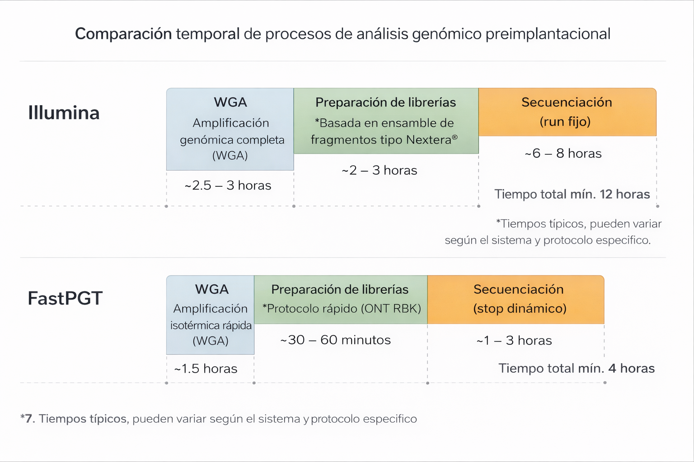

::: callout-note
## Links
**Insumos**: [Library Original](https://nanoporetech.com/document/ligation-sequencing-amplicons-native-barcoding-v14-sqk-nbd114-24). [Library RBK](https://store.nanoporetech.com/rapid-barcoding-sequencing-kit-24-v14.html).  [Extension RAA114](https://store.nanoporetech.com/rapid-adapter-auxiliary-v14.html). [Starter kit. MiniION Mk1D](https://store.nanoporetech.com/minion.html).  [Reporte Havanna - FCEN](inputs/FCEN/report_Nanopore_seq.html). 
 

**Delivery 4**: [Apéndice experimental](appendix-experimental/fase1-havanna.qmd). 

:::

[^flujo-ONT]: Protocolo de trabajo ONT: Ligation sequencing amplicons - Native Barcoding Kit 24 V14 (SQK-NBD114.24)

## 1. Consideraciones básicas del PGT-A

En los estudios de PGT-A, el parámetro que garantiza el diagnóstico preciso es la **cobertura horizontal uniforme**. Este parámetro se mide a través de la distribución de lecturas secuenciadas a lo largo de los 23 pares de cromosomas. Cuanto más homogénea la distribución de  lecturas, más preciso es el análisis informático posterior.

Esta **homogeneidad de lecturas** no depende solamente del proceso de secuenciación, sino de otros parámeros como:

1. Método de WGA
1. Sesgo de amplificación
1. GC bias
1. Filtrado de lecturas
1. Mapeo genómico
1. Tamaño de bins
1. Variabilidad entre muestras

Para la detección de aneuploidías, se utiliza software de descubrimiento de  **CNVs**[^1] que analizan, de diferentes maneras, muchos de estos parámetros. Estos programas realizan **comparaciones relativas de densidad de lecturas** para determinar la ganancia o pérdida de regiones genómicas específicas. Para esto, se utiliza una estrategia de descubrimiento de ventanas móviles (*bins*), típicamente del orden de **0.5–1 Mb**.

[^1]: Copy Number Variants

La sensibilidad y estabilidad del análisis dependen principalmente de:

1.   la **uniformidad global** de la amplificación genómica,
1.   el **número total de lecturas válidas**,
1.   el **tamaño de esas lecturas**,
1.   el **tamaño de ventana** utilizado,
1.   y el **coeficiente de variación (CV)** del perfil de cobertura.

En cualquier tipo de PGT-A, **la mayor o menor profundidad local (en unra región determinada del genoma) es irrelevante**; lo verdaderamente determinante es **la estabilidad estadística de cobertura relativa entre regiones**.

## 2.1.  PGT-A: Secuenciación Illumina {#sec-pgt-illumina}

En el contexto del PGT-A, la **tecnología de secuenciación Illumina representa el standard**. Esta se basa en la secuenciación de lecturas cortas de tamaño fijo a través de ciclos de secuenciación, donde el volumen de secuencia esta fijado *a priori* por la cantidad de insumos que contiene el cartucho de secuenciación y la capacidad del flow-cell utilizado. El esquema general es de 24 muestras, una celda de flujo pequeña (económica), lecturas de 55 pb, 1 Mb de cobertura genómica por embrión de 1Mb y un tiempo total de secuenciación de no menos de 6-7 hs, a las que hay que sumar otro tanto de formación de librerías.

::: callout-important
En Illuimina el esquema de secuenciación se define de antemano, por lo que  la duración de la corrida, como el volumen de datos generado no puede modificarse. Es decir, no existe una opción de *"early-stop"*. 
:::

Las @fig-illumina **A** y **B** muestra el proceso de análisis y variación de parámetros de un estudio PGT-A con valores standard de tecnología Illumina. Las figuras **C** y **D** muestran la evolución de los parámetros de calidad en diferentes estudios. Nótese la perdida de definición a medida que aumenta el coeficiente e variación (CV) desde \~ 0.1 a \~ 0.25.

::::::::: {#fig-illumina}
::::: columns
::: {.column width="50%"}
{width="100%"} **A**
:::

::: {.column width="50%"}
{width="100%"} **B**
:::
:::::

::::: columns
::: {.column width="50%"}
{width="100%"} **C**
:::

::: {.column width="50%"}
{width="100%"} **D**
:::
::::: 
:::::

## 2.2.  PGT-A: Secuenciación ONT {#sec-pgt-ont}

En su ensayo comparativo ONT vs Illumina, **Tan, V.J., et al., (2023)[@Tang_2023]** demostraron que la tecnología **Oxford Nanopore Technologies (ONT)** puede utilizarse de manera equivalente para resolver los PGT-A, alcanzando resoluciones diagnósticas comparables mediante un enfoque de secuenciación de ultra-baja cobertura. Sin embargo, en dicho estudio la secuenciación ONT se emplea bajo un paradigma esencialmente ***batch-completo***, en el cual la corrida se extiende por un tiempo predefinido y el análisis se realiza una vez completada la adquisición de datos.

La @fig-minion-fc muestra el **secuenciador MinION** (**A**) y un flow cell  (**B**) como el utilizado en este ensayo [^3].

[^3]: Este FC contiene 512 poros, y dada la fecha del estudio, posiblemente hayan utilizado el modelo **R9.4.1** (FLO-MIN106).

:::::: {#fig-minion-fc}
::::: columns
::: {.column width="50%"}
{width="100%"} **A**
:::

::: {.column width="50%"}
{width="100%"} **B**
:::
:::::
::::::

## 2.3.  PGT-A: Secuenciación FastPGT {#sec-PGT-fast}

**FastPGT** introduce una variante operativa fundamental sobre el enfoque de Tan et al (2023): la **posibilidad de terminar la corrida en el momento deseado** evaluando dne tiempo real la calidad y cantidad de los datos secuenciados. Es decir, en lugar de fijar el tiempo de corrida, FastPGT define criterios de corte temprano (*early stop*) basados en la cantidad acumulada de datos de calidad agregados por muestra. Solo los necesarios para una lectura robusta del PGT-A. 

**FastPGT no modifica el objetivo diagnóstico** ni los criterios de resolución del PGT-A, sino que **optimiza el flujo operativo**, permitiendo detener la secuenciación una vez alcanzada la **información mínima para la detección robusta de CNVs ≥10 Mb**. 

::: callout-important
Esta estrategia, sumada a la reducción del número de muestras por corrida, reduce de manera significativa el tiempo total del secuenciación, **habilitando escenarios clínicos como la transferencia embrionaria en fresco (FET)** la cual es **incompatible con los enfoques en batch realizados de forma clásica en los PGT-A realizados hasat la fecha**.

:::

## 2.4. Comparativa de Tecnologías PGT-A {#sec-pgt-compara}

La @tbl-comp-illumina-ont muestra las principales diferencias operativas entre estas tres estrategias de PGT-A.

:::: small-section
A pesar de las diferencias en la longitud de lectura y el número de lecturas por muestra, los enfoques operan en un régimen de ultra-baja cobertura con volúmenes totales de datos comparables y **resoluciones de cobertura genómica equivalentes para la detección de CNV ≥10 Mb**.
::::

:::: {#tbl-comp-illumina-ont tbl-cap="Comparación de métricas operativas entre PGT-A estándar (Illumina),  PGT-A ONT y FastPGT."}
::: {style="width: 100%; margin: 0 auto; font-size: 0.8em;"}
| Parámetro | PGT-A estándar (Illumina) | PGT-A ONT | FastPGT |
|:-----------------|-----------------:|-----------------:|-----------------:|
| Plataforma | Illumina (MiSeq) | Oxford Nanopore MinION | Oxford Nanopore MinION |
| Tipo de lectura | Corta | Larga | Larga |
| Muestras por corrida | \~22–27 | \~24 | \~5–10 |
| Longitud efectiva lectura | \~50–75 bp | \~445 bp | \~445 bp |
| Lecturas crudas por muestra | \~0.7–1.2 M | \~100.000–200.000 | \~135.000 Variable |
| Lecturas válidas por muestra | \~750–1.000 K | \~100.000 | \~100.000 |
| Bases totales por muestra | \~41–80 Mb | \~45 Mb | 45 Mb (objetivo) |
| Bases totales por corrida | ~1.0–1.5 Gb | ~1.0–1.1 Gb | ~0.23–0.45 Gb |
| Cobertura horizontal | \~1.0–1.5% | \~1–2% | \~1–2% |
| Tamaño de ventana (bin) | \~1 Mb | \~1 Mb | \~1 Mb |
| Resolución CNV | ≥10 Mb | ≥10 Mb | ≥10 Mb |
| Tiempo de secuenciación | ≥7 - 8 h | \~ 24 h | 2 – 3 h |
| Criterio de corte de corrida | Tiempo fijo / reads fijos | Tiempo fijo | Gb Passed |
| Early stop | No disponible | No utilizado | Implementado |
| Reuso del flow cell | No aplicable | Posible | Si, parte del diseño |
| Reuso del Kit de Librería | No aplicable | No necesario | Si, parte del diseño |
| Flexibilidad operativa | Baja | Media | Alta |
| Transferencia en fresco | No | No | Posible |
:::
::::

::: callout-important
La adquisición de datos en tiempo real, la definición de criterios de corte temprano (*early stop*) y el reuso controlado del flow cell introducen ventajas operativas específicas del enfoque ONT, particularmente relevantes para estrategias orientadas a la transferencia embrionaria en fresco.

:::

## 3. Amplificación genómica, formación de librerías y tiempos comparados

La **@fig-time-comparison** resume el flujo de trabajo completo del PGT-A, incluyendo no solo la etapa de secuenciación sino también los pasos previos de amplificación genómica completa (WGA) y formación de librerías. 

{#fig-time-comparison width="100%"}

En los esquemas convencionales basados en Illumina, estos pasos representan una fracción sustancial del tiempo total del ensayo, con una WGA típicamente basada en PCR (p. ej. SurePlex) de ~2.5–3 h, seguida de protocolos de preparación de librerías de ~2-3 h adicionales. En conjunto, el tiempo previo a la secuenciación se sitúa en el orden de 6-7 horas, al que se suma un tiempo de corrida de ~6–8 horas, configurando un proceso total (12-15 hs)  para 24 muestras, los cual no sólo excede ampliamente la ventana temporal deseable para el FastPGT, sino que lo hace económicamente imposible para un número de muestras menor a 24.

Si bien existen alternativas comerciales económicas para la preparación de librerías compatibles con plataformas Illumina (p. ej. Yikon Genomics u otros proveedores), estas estrategias no modifican de manera sustancial la estructura temporal ni económica del flujo de trabajo en batch. 

En particular, la etapa de WGA continúa siendo el principal cuello de botella inicial, y los protocolos de preparación de librerías —aunque puedan reducir costos por muestra o simplificar ciertos pasos— mantienen tiempos operativos comparables y **no eliminan la necesidad de corridas en batch completas**. 

::: callout-note
En consecuencia, el esquema Illumina permanece condicionado por una lógica secuencial rígida, en la cual ni el volumen de datos ni el tiempo total pueden adaptarse dinámicamente a la necesidad clínica para posibilitar la transferencia en fresco.
:::

En contraste, el esquema FastPGT representado en la **@fig-time-comparison** y **@fig-fastpgt-workflow** introduce una optimización simultánea de tiempos y costos a lo largo de todo el flujo. Esto incluye: 

1.  el uso de WGA isotérmica (p. ej. phi29-XT), con tiempos más cortos y menor complejidad operativa; 

1. protocolos rápidos de formación de librerías (ONT Rapid Barcoding y Rapid Adapter), del orden de 30–60 minutos;

1. una secuenciación basada en adquisición en tiempo real con criterios de corte temprano (early stop), y

1. el reuso del flowcell

**A este esquema se le suma un elemento económico diferencial clave**: la posibilidad de maximizar el rendimiento de todos los barcodes del kit (RBK) mediante el uso de insumos de extendión (RAA) que minimizan la pérdida de reactivos en corridas de pocas muestras y el reuso del flowcell en múltiples corridas

::: callout-important

En conjunto, estas características transforman el proceso en un sistema dinámico, en el cual tanto el tiempo como el costo efectivo por muestra se ajustan a la cantidad real de datos requeridos, minimizando al máximo los tiempos y los costos.

:::

## 4. Flujo de trabajo FastPGT {#sec-flujo}

La **@fig-fastpgt-workflow** representa el flujo de trabajo del FastPGT.

El proceso integra amplificación genómica, construcción de librerías y secuenciación en tiempo real, incorporando criterios operativos de corte temprano que optimizan tiempos y recursos.

{#fig-fastpgt-workflow width="100%"}

A partir de la biopsia embrionaria, el ADN genómico es sometido a una etapa de **Whole Genome Amplification (WGA)**, utilizando amplificación isotérmica (p. ej. phi29-XT). El objetivo de esta etapa no es alcanzar cobertura profunda, sino generar una representación suficientemente uniforme del genoma que permita inferencias fiables a ultra-baja cobertura, condición clave para el análisis de aneuploidías en PGT-A.

El ADN amplificado es procesado mediante **sequence tagmentation**, seguido de la **ligación de barcodes nativos**, asignando un identificador molecular único a cada embrión. Este esquema permite la multiplexación de múltiples muestras en una misma corrida de secuenciación sin perder trazabilidad individual. Tras la purificación y cuantificación, las muestras barcodiadas se combinan en un **pool equimolar**, sobre el cual se realiza una única reacción de **ligación de adaptadores Nanopore**.

La librería final se prepara en la mezcla de carga y se secuencia en un **flowcell R10.4.1**. Durante la corrida, el sistema MinKNOW adquiere señales eléctricas en tiempo real que son convertidas en secuencias mediante algoritmos de basecalling. Esta adquisición continua habilita la definición de **criterios operativos de corte temprano (*early stop*)**, basados en la cantidad acumulada de datos por embrión (por ejemplo, ~45 Mb), optimizando el uso del flowcell y permitiendo su lavado y reutilización en corridas sucesivas.

El resultado del proceso es un conjunto de lecturas demultiplexadas por barcode, con cobertura horizontal suficiente para el control de calidad, la estimación de cobertura genómica y la detección de aneuploidías. Este enfoque integra eficiencia técnica, control temporal y optimización de recursos, y constituye la base operativa que diferencia al FastPGT de los esquemas convencionales de PGT-A.

::: callout-important

Los supuestos operativos asociados a la amplificación genómica, la profundidad de secuenciación y los criterios de suficiencia de datos se evalúan de manera empírica en los apéndices experimentales y económicos que acompañan este documento.

::: 

## 5. Dinámica de la producción de secuencias

Como hemos insistido en el [Documento principal](index.qmd), la tecnología ONT nos permite evaluar en **tiempo real** un  aspecto central del ensayo:  la **dinámica temporal de producción de datos**, expresada tanto en **bases secuenciadas** como en **número de lecturas** a lo largo de la corrida.

La @fig-tiempos muestra la **evolución temporal** de producción de bases (**A**) y lecturas (**B**) producidas en el [Ensayo Havanna ](appendix-experimental.qmd#sec-Havanna-assay). Como puede observarse, tanto las bases como las lecturas —en sus versiones totales (*estimated*) y filtradas por calidad (*passed*)— presentan un **crecimiento continuo y aproximadamente lineal** a lo largo del tiempo, lo que indica un rendimiento estable del flow cell durante la corrida.

:::::: {#fig-tiempos}
::::: columns
::: {.column width="50%"}
{width="100%"} **A**
:::

::: {.column width="50%"}
{width="100%"} **B**
:::
:::::
::::::

Este parámetro es importante ya que **nos permitiría predecir en los primero minutos de corrida si el flow cell es apto y puede completar el ensayo**. Si no lo es, se opta por detener la corrida y utilizar un nuevo flow cell.

### 5.1. Dinámica del uso de poros y calidad de las secuencias

Para analizar el rendimiento de la corrida se consideran **dos variables
dinámicas principales**:\
(i) el **número de poros activos** disponibles para secuenciación y\
(ii) la **calidad de las lecturas** generadas a lo largo del tiempo.

Ambas variables evolucionan durante la corrida y constituyen **parámetros críticos de monitoreo**, que deben ser evaluados tanto en la fase inicial como durante la ejecución del ensayo, ya que condicionan directamente el rendimiento efectivo del flow cell y la confiabilidad de los datos obtenidos.

La @fig-porosQC muestra la **dinámica temporal** del uso de poros en el flow cell (**A**) y la **distribución de calidad de las lecturas** (**B**) a lo largo de la corrida. Como puede observarse, a lo largo de aproximadamente **18 h de secuenciación**, el número de poros activos disminuye progresivamente —un comportamiento esperado— mientras que la **calidad de las lecturas se mantiene estable**, lo cual representa una condición deseable para ensayos de secuenciación orientados a aplicaciones clínicas.

:::::: {#fig-porosQC}
::::: columns
::: {.column width="50%"}
{width="100%"} **A**
:::

::: {.column width="50%"}
{width="100%"} **B**
:::
:::::
::::::

::: callout-important
**Early Stop**

El monitoreo sistemático de estos parámetros —tanto durante la corrida como antes de una eventual reutilización del flow cell— permite un control ajustado del uso de los recursos de secuenciación, garantizando estándares elevados de calidad. En este contexto, la disponibilidad de métricas en tiempo real habilita además la definición de criterios operativos de **corte temprano (early stop)**, basados en la cantidad de datos efectivos generados (Gb passed), evitando corridas innecesariamente prolongadas y optimizando la eficiencia global del ensayo.
::: 

