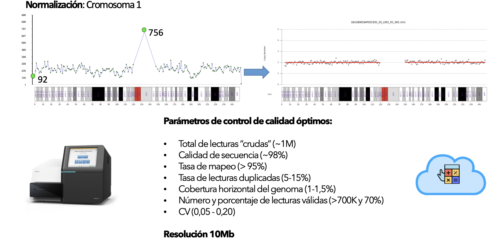
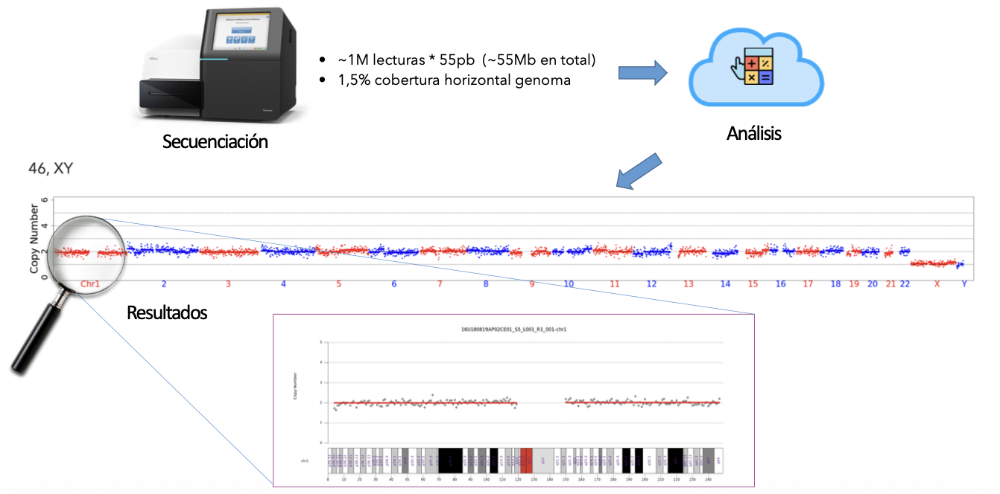
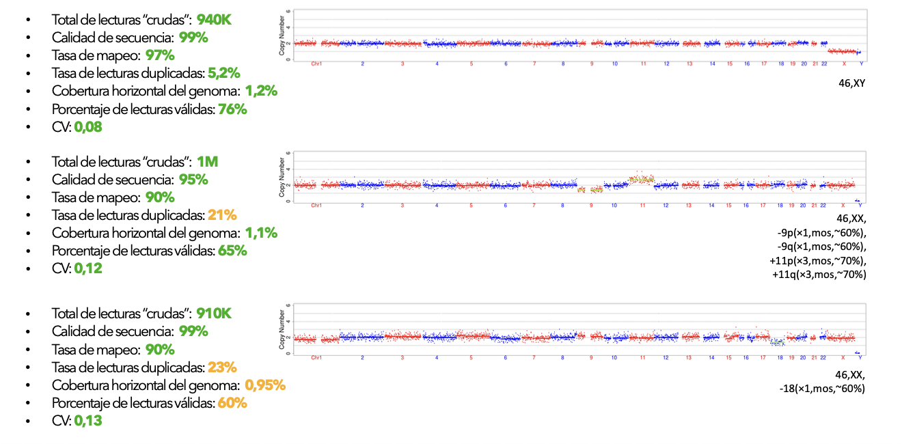
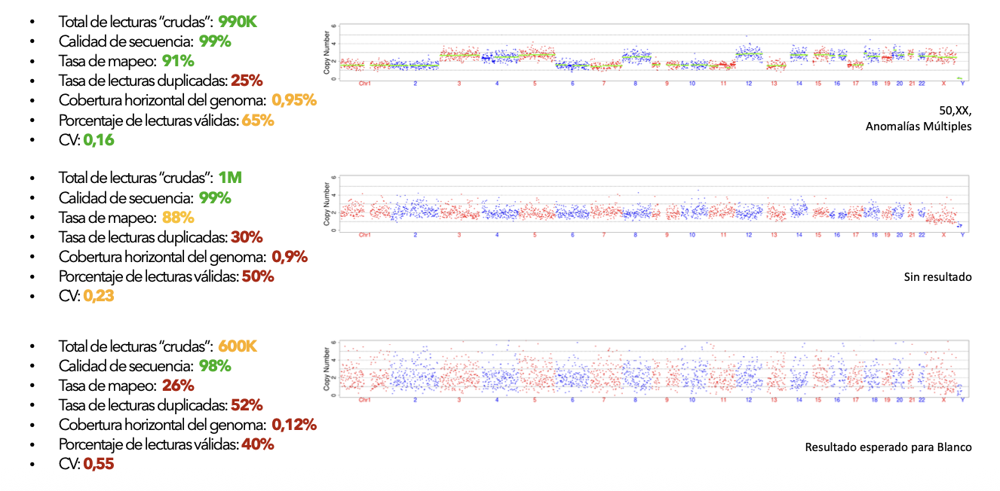
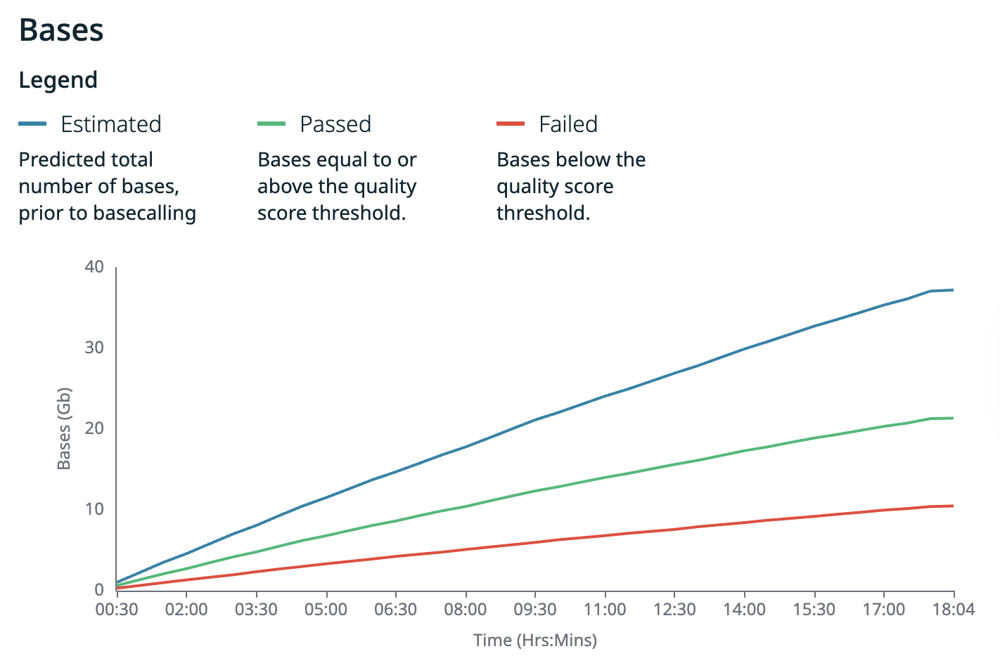
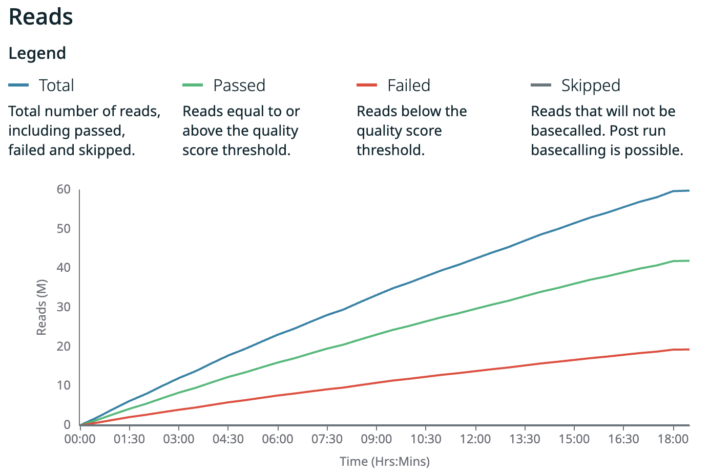
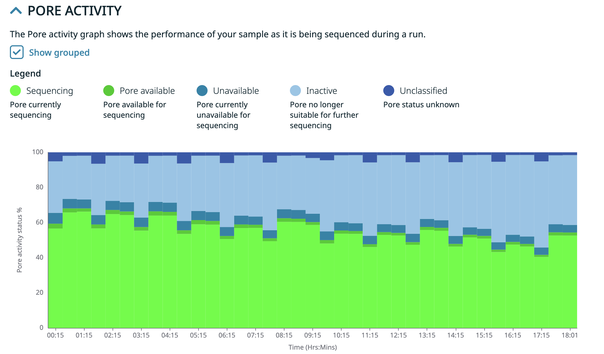
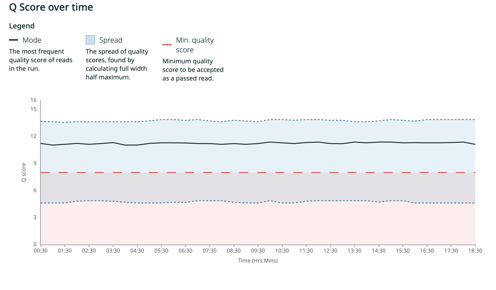

::: callout-note
## **Contenido**

1. Consideraciones básicas sobre el PGT-A
2. PGT-A Illumina (convencional), PGT-A ONT y FastPGT
   - Comparación de parámetros:
     * Número de muestras, cobertura, longitud de lecturas, rendimiento total por corrida y por muestra (entre otras), para una comprensión exhaustiva de cada tecnología y sus diferencias.
3. Flujo de trabajo FastPGT en el laboratorio.
4. Dinámica de producción de secuencias.
5. Dinámica del uso de poros y calidad de las secuencias.
6. Concepto de Early Stop.

**Insumos**: Protocolo de formación de librerias ONT[^flujo-ONT]. [Reporte Havanna - FCEN](inputs/FCEN/report_Nanopore_seq.html)

**Delivery 4**: [Documento principal](index.qmd). [Apéndice experimental](appendix-experimental.qmd). [Apéndice económico](appendix-costs.qmd). 

:::

[^flujo-ONT]: Protocolo de trabajo ONT: Ligation sequencing amplicons - Native Barcoding Kit 24 V14 (SQK-NBD114.24)

## 1. Consideraciones básicas del PGT-A

En los estudios de PGT-A, el parámetro crítico es la **cobertura horizontal uniforme**, entendida como el muestreo distribuido de regiones genómicas a lo largo de todos los cromosomas.

La detección de **CNVs**[^1] en cada cromosoma se basa en**comparaciones relativas de densidad de lecturas** entre regiones genómicas, evaluadas mediante ventanas móviles (*bins*) de tamaño fijo, típicamente del orden de **0.5–1 Mb**.

[^1]: **C**opy **N**umber **V**ariants en forma de aneuploidías o mosaicismos

La sensibilidad y estabilidad del análisis dependen principalmente de:

1.   la **uniformidad global** de la amplificación genómica,
1.   el **número total de lecturas válidas**,
1.   el **tamaño de esas lecturas**,
1.   el **tamaño de ventana** utilizado,
1.   y el **coeficiente de variación (CV)** del perfil de cobertura.

En este régimen, **la profundidad local puntual es irrelevante**[^2]; lo determinante es la estabilidad estadística del perfil relativo entre regiones.

[^2]: Este parámetro, sin embargo, es fundamental en el descubrimiento de variantes, como en el **Proyecto Yaguarecito**.

## 2.1.  PGT-A: Illumina {#sec-pgt-illumina}

En el contexto del PGT-A, la **tecnología Illumina representa el enfoque convencional** , basado en secuenciación de lecturas cortas y en la adquisición completa de los datos antes de iniciar el análisis. En este esquema, el volumen de secuenciación esta fijado *a priori* y la corrida debe completarse independientemente de si la información obtenida es suficiente para la inferencia diagnóstica.

Las @fig-illumina **A** y **B** muestra el proceso de análisis y variación de parámetros de un estudio PGT-A con valores standard de tecnología Illumina. Las figuras **C** y **D** muestran la evolución de los parámetros de calidad en diferentes estudios. Nótese la perdida de definición a medida que aumenta el CV desde \~ 0.1 a \~ 0.25.

::::::::: {#fig-illumina}
::::: columns
::: {.column width="50%"}
{width="100%"} **A**
:::

::: {.column width="50%"}
{width="100%"} **B**
:::
:::::

::::: columns
::: {.column width="50%"}
{width="100%"} **C**
:::

::: {.column width="50%"}
{width="100%"} **D**
:::
::::: 
:::::

## 2.2.  PGT-A: Tan y col., (2023) ONT {#sec-pgt-ont}

En su ensayo comparativo ONT vs Illumina, **Tan, V.J., et al., (2023)[@Tang_2023]** demostraron que la tecnología **Oxford Nanopore Technologies (ONT)** puede utilizarse de manera equivalente para resolver los PGT-A, alcanzando resoluciones diagnósticas comparables mediante un enfoque de secuenciación de ultra-baja cobertura. Sin embargo, en dicho estudio la secuenciación ONT se emplea bajo un paradigma esencialmente ***batch-completo***, en el cual la corrida se extiende por un tiempo predefinido y el análisis se realiza una vez completada la adquisición de datos.

La @fig-minion-fc muestra el **secuenciador MinION** (**A**) y un flow cell  (**B**) como el utilizado en este ensayo [^1].

[^1]: Este FC contiene 512 poros, y dada la fecha del estudio, posiblemente hayan utilizado el modelo **R9.4.1** (FLO-MIN106).

:::::: {#fig-minion-fc}
::::: columns
::: {.column width="50%"}
{width="100%"} **A**
:::

::: {.column width="50%"}
{width="100%"} **B**
:::
:::::
::::::

## 2.3.  PGT-A: Fast {#sec-PGT-fast}

**FastPGT** introduce una variante operativa sobre este enfoque, explotando una característica intrínseca de la tecnología ONT que no está disponible en otras plataformas NGS: la **generación y evaluación de datos en tiempo real**. En lugar de fijar el tiempo de corrida, FastPGT define criterios de corte temprano (*early stop*) basados en la cantidad acumulada de datos que superan los filtros de calidad, expresados en términos de cobertura horizontal agregada.

::: callout-note
De este modo, **FastPGT no modifica el objetivo diagnóstico** ni los criterios de resolución del PGT-A, sino que **optimiza el flujo operativo**, permitiendo detener la secuenciación una vez alcanzada la **información mínima para la detección robusta de CNVs ≥10 Mb**. Esta estrategia, sumada a la reducción del número de muestras en la corrida, reduce de manera significativa el tiempo total del ensayo, mejorando la eficiencia en el uso del flow cell y habilita escenarios clínicos incompatibles con los enfoques batch-completos de Tan, et al (2023), como la transferencia embrionaria en fresco.
:::

## 2.4. Comparativa de Tecnologías PGT-A {#sec-pgt-compara}

La @tbl-comp-illumina-ont muestra las principales diferencias operativas entre estas tres estrategias de PGT-A.

:::: small-section
A pesar de las diferencias en la longitud de lectura y el número de lecturas por muestra, los enfoques operan en un régimen de ultra-baja cobertura con volúmenes totales de datos comparables y **resoluciones de cobertura genómica equivalentes para la detección de CNV ≥10 Mb**.
::::

:::: {#tbl-comp-illumina-ont tbl-cap="Comparación de métricas operativas entre PGT-A estándar (Illumina),  PGT-A ONT y FastPGT."}
::: {style="width: 100%; margin: 0 auto; font-size: 0.8em;"}
| Parámetro | PGT-A estándar (Illumina) | PGT-A ONT | FastPGT |
|:-----------------|-----------------:|-----------------:|-----------------:|
| Plataforma | Illumina (MiSeq) | Oxford Nanopore MinION | Oxford Nanopore MinION |
| Tipo de lectura | Corta | Larga | Larga |
| Muestras por corrida | \~22–27 | \~24 | \~5–10 |
| Longitud efectiva lectura | \~50–75 bp | \~445 bp | \~445 bp |
| Lecturas crudas por muestra | \~0.7–1.2 M | \~100.000–200.000 | \~135.000 Variable |
| Lecturas válidas por muestra | \~750–1.000 K | \~100.000 | \~100.000 |
| Bases totales por muestra | \~41–80 Mb | \~45 Mb | 45 Mb (objetivo) |
| Bases totales por corrida | ~1.0–1.5 Gb | ~1.0–1.1 Gb | ~0.23–0.45 Gb |
| Cobertura horizontal | \~1.0–1.5% | \~1–2% | \~1–2% |
| Tamaño de ventana (bin) | \~1 Mb | \~1 Mb | \~1 Mb |
| Resolución CNV | ≥10 Mb | ≥10 Mb | ≥10 Mb |
| Tiempo de secuenciación | ≥7 - 8 h | \~ 24 h | 2 – 3 h |
| Criterio de corte de corrida | Tiempo fijo / reads fijos | Tiempo fijo | Gb Passed |
| Early stop | No disponible | No utilizado | Implementado |
| Reuso del flow cell | No aplicable | Posible | Si, parte del diseño |
| Flexibilidad operativa | Baja | Media | Alta |
| Transferencia en fresco | No | No | Posible |
:::
::::

::: callout-important
La adquisición de datos en tiempo real, la definición de criterios de corte temprano (*early stop*) y el reuso controlado del flow cell introducen ventajas operativas específicas del enfoque ONT, particularmente relevantes para estrategias orientadas a la transferencia embrionaria en fresco.

*Esta combinación de posibilidades en pos del objetivo de lograr transferencias en fresco no fue mencionada por Tan, y col. 2023*.
:::

## 3. Flujo de trabajo FastPGT {#sec-flujo}

La **@fig-fastpgt-workflow** representa el flujo de trabajo del FastPGT [^flujo-ONT].

El esquema resume las etapas principales desde la biopsia embrionaria y la amplificación genómica completa hasta la adquisición de datos en tiempo real y la generación de lecturas demultiplexadas para el análisis de aneuploidías. La posibilidad de corte temprano permite optimizar tiempos de secuenciación y reutilizar el flowcell.

{#fig-fastpgt-workflow width="100%"}

El proceso integra amplificación genómica, construcción de librerías y secuenciación en tiempo real, incorporando criterios operativos de corte temprano que optimizan tiempos y recursos.

A partir de la biopsia embrionaria, el ADN genómico es sometido a una etapa de **Whole Genome Amplification (WGA)**, utilizando amplificación isotérmica (p. ej. phi29-XT) o amplificación por PCR múltiple (p. ej. SurePlex). El objetivo de esta etapa no es alcanzar cobertura profunda, sino generar una representación suficientemente uniforme del genoma que permita inferencias fiables a ultra-baja cobertura, condición clave para el análisis de aneuploidías en PGT-A.

El ADN amplificado es procesado mediante **end-repair y dA-tailing**, seguido de la **ligación de barcodes nativos**, asignando un identificador molecular único a cada embrión. Este esquema permite la multiplexación de múltiples muestras en una misma corrida de secuenciación sin perder trazabilidad individual. Tras la purificación y cuantificación, las muestras barcodiadas se combinan en un **pool equimolar**, sobre el cual se realiza una única reacción de **ligación de adaptadores Nanopore**.

La librería final se prepara en la mezcla de carga y se secuencia en un **flowcell R10.4.1**. Durante la corrida, el sistema MinKNOW adquiere señales eléctricas en tiempo real que son convertidas en secuencias mediante algoritmos de basecalling. Esta adquisición continua habilita la definición de **criterios operativos de corte temprano (*early stop*)**, basados en la cantidad acumulada de datos por embrión (por ejemplo, ~45 Mb), optimizando el uso del flowcell y permitiendo su lavado y reutilización en corridas sucesivas.

El resultado del proceso es un conjunto de lecturas demultiplexadas por barcode, con cobertura horizontal suficiente para el control de calidad, la estimación de cobertura genómica y la detección de aneuploidías. Este enfoque integra eficiencia técnica, control temporal y optimización de recursos, y constituye la base operativa que diferencia al FastPGT de los esquemas convencionales de PGT-A.

::: callout-important

Los supuestos operativos asociados a la amplificación genómica, la profundidad de secuenciación y los criterios de suficiencia de datos se evalúan de manera empírica en los apéndices experimentales y económicos que acompañan este documento.

::: 

## 4.1. Dinámica de la producción de secuencias

Como hemos insistido en el [Documento principal](index.qmd), la tecnología ONT nos permite evaluar en **tiempo real** un  aspecto central del ensayo:  la **dinámica temporal de producción de datos**, expresada tanto en **bases secuenciadas** como en **número de lecturas** a lo largo de la corrida.

La @fig-tiempos muestra la **evolución temporal** de producción de bases (**A**) y lecturas (**B**) producidas en el [Ensayo Havanna ](appendix-experimental.qmd#sec-Havanna-assay). Como puede observarse, tanto las bases como las lecturas —en sus versiones totales (*estimated*) y filtradas por calidad (*passed*)— presentan un **crecimiento continuo y aproximadamente lineal** a lo largo del tiempo, lo que indica un rendimiento estable del flow cell durante la corrida.

:::::: {#fig-tiempos}
::::: columns
::: {.column width="50%"}
{width="100%"} **A**
:::

::: {.column width="50%"}
{width="100%"} **B**
:::
:::::
::::::

Este parámetro es importante ya que **nos permitiría predecir en los primero minutos de corrida si el flow cell es apto y puede completar el ensayo**. Si no lo es, se opta por detener la corrida y utilizar un nuevo flow cell.

## 4.2. Dinámica del uso de poros y calidad de las secuencias

Para analizar el rendimiento de la corrida se consideran **dos variables
dinámicas principales**:\
(i) el **número de poros activos** disponibles para secuenciación y\
(ii) la **calidad de las lecturas** generadas a lo largo del tiempo.

Ambas variables evolucionan durante la corrida y constituyen **parámetros críticos de monitoreo**, que deben ser evaluados tanto en la fase inicial como durante la ejecución del ensayo, ya que condicionan directamente el rendimiento efectivo del flow cell y la confiabilidad de los datos obtenidos.

La @fig-porosQC muestra la **dinámica temporal** del uso de poros en el flow cell (**A**) y la **distribución de calidad de las lecturas** (**B**) a lo largo de la corrida. Como puede observarse, a lo largo de aproximadamente **18 h de secuenciación**, el número de poros activos disminuye progresivamente —un comportamiento esperado— mientras que la **calidad de las lecturas se mantiene estable**, lo cual representa una condición deseable para ensayos de secuenciación orientados a aplicaciones clínicas.

:::::: {#fig-porosQC}
::::: columns
::: {.column width="50%"}
{width="100%"} **A**
:::

::: {.column width="50%"}
{width="100%"} **B**
:::
:::::
::::::

::: callout-important
**Early Stop**

El monitoreo sistemático de estos parámetros —tanto durante la corrida como antes de una eventual reutilización del flow cell— permite un control ajustado del uso de los recursos de secuenciación, garantizando estándares elevados de calidad. En este contexto, la disponibilidad de métricas en tiempo real habilita además la definición de criterios operativos de **corte temprano (early stop)**, basados en la cantidad de datos efectivos generados (Gb passed), evitando corridas innecesariamente prolongadas y optimizando la eficiencia global del ensayo.
::: 

