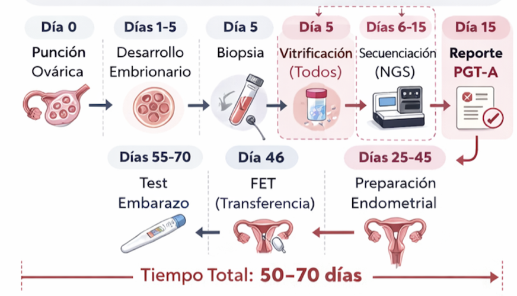
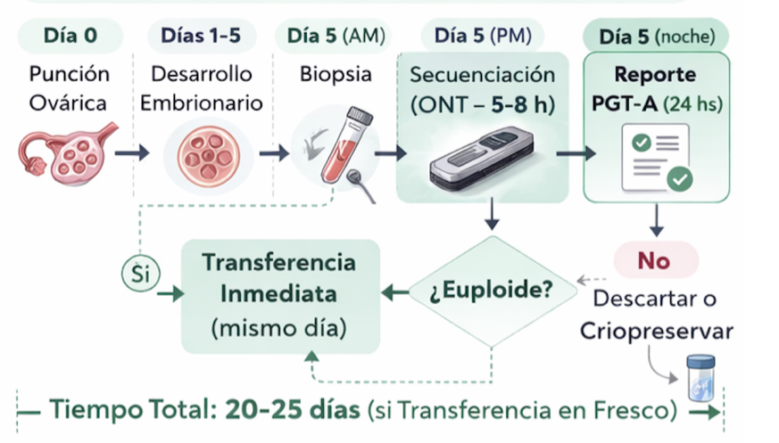

## 1. Objetivo

El objetivo de este informe es doble: por un lado, mostrar que **FastPGT** es una estrategia **técnicamente viable y económicamente competitiva** frente al PGT-A convencional, y por otro, delinear una **propuesta general de inversión** para el desarrollo de este producto en: **2PQ: Precision & Quick Genomics**, una empresa de **diagnóstico genómico rápido** en escenarios donde el tiempo de respuesta es clínicamente crítico.

Este documento presenta los elementos necesarios para comprender el problema, la solución propuesta y los escenarios operativos viables. Los fundamentos técnicos, experimentales y económicos se desarrollan en los **Apéndices** que acompañan este informe.

## 2. Problema

En los esquemas convencionales de Diagnóstico Genético Preimplantacional de Aneuploidías **(PGT-A)**, el **tiempo de entrega de resultados** suele extenderse entre varios días o semanas. Esta limitación temporal obliga, en la práctica del laboratorio de embriología, a **vitrificar el embrión** luego de la biopsia y **posponer la transferencia del o de los embriones seleccionados a un ciclo posterior** (@fig-cycle).

:::: {#fig-cycle}
::: {.column width="100%"}
{width="80%"}
:::
::::

Este enfoque introduce una serie de **consecuencias clínicas y operativas** relevantes en el centro de fertilización asistida, entre las que se incluyen la interrupción del desarrollo embrionario mediante **vitrificación y desvitrificación (warming)**, el aumento de manipulaciones técnicas, la necesidad de **ciclos diferidos** con mayor **complejidad logística de las clínicas**, y un **incremento significativo del costo total del tratamiento** para el paciente. Adicionalmente, la prolongación del proceso se asocia a mayor **ansiedad del paciente** y mayores tasas de abandono.

::: callout-note
El PGT-A convencional genera **flujos de trabajo fragmentados**, regulando de manera obligada la operatividad de las clínicas de reproducción asistida.
:::

## 3. Solución: FastPGT

FastPGT propone un cambio de paradigma: obtener un resultado del PGT-A dentro de una ventana temporal **compatible con la transferencia embrionaria en fresco** (FET), sin necesidad de vitrificación post-biopsia (@fig-fastpgt).

:::: {#fig-fastpgt}
::: {.column width="100%"}
{width="80%"}
:::
::::

El enfoque se basa en el uso de **secuenciación en tiempo real** mediante Oxford Nanopore Technologies (ONT), y explota tres características operativas clave de esta tecnología:

-   **Adquisición y evaluación dinámica de los datos**,
-   **Corte temprano (*early stop*)** una vez alcanzada la información mínima requerida,
-   **Reuso controlado del flow cell**, optimizando el costo por ensayo.

Estas propiedades permiten adaptar el ensayo al número real de embriones disponibles y al tiempo clínico efectivo, sin comprometer la robustez diagnóstica requerida para PGT-A.

Como consecuencia, **FastPGT elimina la necesidad de vitrificación post-biopsia**, reduce la fragmentación del proceso clínico y **devuelve a la clínica un mayor control sobre los tiempos del tratamiento**, sin dependencia de laboratorios externos ni calendarios diferidos.

## 4. Escenarios operativos de FastPGT

El análisis conjunto de los resultados experimentales y del modelo económico permite definir un **conjunto acotado de escenarios operativos viables** para la implementación clínica de FastPGT. Estos escenarios se derivan directamente de:

-   los **umbrales de datos por embrión** evaluados experimentalmente (45–75 Mb),
-   los **tiempos de secuenciación estimados** bajo esquemas de *early stop*,
-   y el **prorrateo de costos por corrida y por embrión** bajo políticas realistas de reutilización del *flow cell*.

Los fundamentos técnicos de estos escenarios se desarrollan en el [**Apéndice Experimental**](appendix-experimental.qmd#sec-times) y los supuestos económicos en el [**Apéndice Económico**](appendix-costs.qmd#sec-costos-corridas).

### 4.1. Resumen operativo de escenarios FastPGT

::: {style="width: 100%; margin: 0 auto; font-size: 0.80em;"}
| Escenario | Embriones | Mb / embrión | Tiempo / seq\* | Costo total\*\* | Costo / embrión\*\* |
|:-----------|-----------:|-----------:|:----------:|-----------:|-----------:|
| FastPGT (baja carga) | 5–6 | \~45 Mb | \~1–2 h | \~760–920 | \~150–170 |
| FastPGT (carga intermedia) | 7–10 | \~45–75 Mb | \~1.5–3 h | \~880–1,150 | \~110–140 |
| Batch no-FastPGT | 24 | \~45 Mb | ≥3–4 h | \~2,050–2,240 | \~85–95 |

\* Tiempos estimados para MinION R10.4.1 bajo esquemas de *early stop* definidos por **Gb passed**, según rangos de rendimiento documentados en el **Apéndice Experimental**.\
\*\* Costos estimados para políticas de reutilización del *flow cell* con **4 ≤ k ≤ 6**, según el modelo detallado en el **Apéndice Económico**.
:::

### 4.2. Interpretación operativa

-   Los escenarios **FastPGT (5–10 embriones)** permiten obtener resultados genéticos dentro de **ventanas temporales compatibles con transferencia embrionaria en fresco**, sin requerir vitrificación post-biopsia.
-   El costo por embrión en estos escenarios se mantiene **competitivo** y queda ampliamente compensado por los **ahorros clínicos indirectos** asociados a la eliminación de ciclos FET.
-   El escenario **batch (24 embriones)** representa una alternativa económicamente eficiente cuando el tiempo no es crítico, pero **no habilita transferencia en fresco** y reproduce la lógica operativa del PGT-A convencional.

En conjunto, estos escenarios definen un **marco operativo flexible**, en el cual FastPGT puede adaptarse tanto a contextos clínicos orientados a rapidez de decisión como a esquemas de procesamiento por volumen, manteniendo coherencia técnica y económica.

## 5. Impacto clínico y económico

La posibilidad de realizar transferencia embrionaria en fresco reduce manipulaciones técnicas, simplifica el flujo asistencial y preserva la sincronía embrión–endometrio. Desde el punto de vista económico, los ahorros asociados a la eliminación de vitrificación, warming y ciclos diferidos superan ampliamente el costo incremental del test genético.

FastPGT permite así redistribuir el costo del diagnóstico genético dentro del proceso global de FIV, mejorando la eficiencia clínica y la experiencia del paciente.

Para una descripción completa sobre los costos asociados a la eliminación de estos pasos intermedios en las clínica de IVF, ver [Ventajas económicas del FET](appendix-costs.qmd#sec-ecofet).

## 6. FastPGT primer producto 2PQ

FastPGT no constituye únicamente una optimización técnica del PGT-A, sino un **habilitador tecnológico** para nuevos modelos de servicio basados en diagnóstico genómico rápido. Yaguarecito es otro!

En este contexto, **2PQ: Precision & Quick Genomics** se plantea como una plataforma orientada a proveer diagnóstico genómico de alta precisión en escenarios donde el tiempo de respuesta es crítico, tanto en reproducción asistida como en medicina neonatal.

Queda desarrollar el apéndice CAPEX 2PQ..

::: callout-note
## **Conclusiones**

-   **FastPGT es técnicamente viable**, basado en principios sólidos de cobertura genómica y secuenciación en tiempo real.
-   La **evidencia experimental disponible** demuestra equivalencia diagnóstica con el PGT-A convencional para CNV ≥10 Mb.
-   El modelo operativo permite **corridas flexibles de 5–10 embriones**, compatibles con transferencia embrionaria en fresco.
-   Desde el punto de vista económico, FastPGT es **competitivo por embrión** y genera **ahorros netos relevantes** al eliminar vitrificación y ciclos diferidos.
-   FastPGT se posiciona como una **plataforma tecnológica robusta** para innovación en diagnóstico genómico aplicado a reproducción asistida.

Los apéndices que acompañan este documento proporcionan el detalle técnico, experimental y económico necesario para una evaluación completa y fundamentada.
:::

## 7. Calculadora interactiva FastPGT

La aplicación puede ejecutarse desde cualquier ubicación en la terminal:

::: {#fastpgt-command style="background-color:#f4f4f4; padding:15px; border-radius:8px; font-family:monospace;"}
cd \~/Documents/2pq/FastPGT && R -e "shiny::runApp('FastPGT_app')"
:::

<button onclick="copyCommand()" style="margin-top:10px; background-color:#2F4F4F; color:white; padding:10px 16px; border:none; border-radius:6px; cursor:pointer;">

📋 Copiar comando

</button>

```{=html}
<script>
function copyCommand() {
  const text = `cd ~/Documents/2pq/FastPGT && R -e "shiny::runApp('FastPGT_app')"`;
  navigator.clipboard.writeText(text).then(function() {
    document.getElementById("copy-msg").textContent = "Comando copiado";
    setTimeout(function() {
      document.getElementById("copy-msg").textContent = "";
    }, 2000);
  }).catch(function(err) {
    document.getElementById("copy-msg").textContent = "No se pudo copiar";
  });
}
</script>
```

> Una vez ejecutado, abrir en el navegador la URL mostrada en consola (ej: http://127.0.0.1:xxxx)
